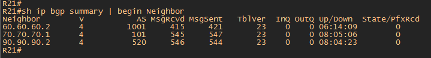

#  eBGP. Основы

###  Задание:

BGP. Основы

Цель: Настроить BGP между автономными системами.

Организовать доступность между офисами Москва и С.-Петербург

1. eBGP между офисом Москва и двумя провайдерами - Киторн и Ламас
2. Настроите eBGP между провайдерами Киторн и Ламас
3. Настроите eBGP между Ламас и Триада
4. eBGP между офисом С.-Петербург и провайдером Триада
5. Организуете IP доступность между офисами Москва и С.-Петербург

- [Конфигурационные файлы](config/)

### Схема сети

### Адресация между AS по BGP

Киторн (AS101) - Москва (AS1001)

| Network IPv4     | Network IPv6    |  Eq&port          |
|-----------------:|:---------------|-------------------------:|
| 50.50.50.0/28    | 20AA:BBCC:50:50::/64   | R22e0/0  R14e0/2 |

Ламас (AS301) - Москва (AS1001)
| Network IPv4     | Network IPv6    |  Eq&port          |
|-----------------:|:---------------|-------------------------:|
| 60.60.60.0/28    | 20AA:BBCC:60:60::/64   | R21e0/0  R15e0/2 |

Киторн (AS101) - Ламас (AS301)

| Network IPv4     | Network IPv6    |  Eq&port          |
|-----------------:|:---------------|-------------------------:|
| 70.70.70.0/28    | 20AA:BBCC:70:70::/64   | R22e0/1  R21e0/1 |

Ламас (AS301) - Триада (AS520)
| Network IPv4     | Network IPv6    |  Eq&port          |
|-----------------:|:---------------|-------------------------:|
| 90.90.90.0/28    | 20AA:BBCC:90:90::/64   | R21e0/2  R24e0/0 |

Триада (AS520) - С.Питербург (AS 2042)
| Network IPv4     | Network IPv6    |  Eq&port          |
|-----------------:|:---------------|-------------------------:|
| 100.100.100.0/28    | 20AA:BBCC:100:100::/64   | R24e0/3  R18e0/2 |
| 110.110.110.0/28    | 20AA:BBCC:110:110::/64   | R26e0/3  R18e0/3 |

### Конфигурация маршрутизаторов сводиться к следующим настройкам:

1. Включаем на всех роутерах процес BGP с номером AS указанном в задании. 
          
       RX(config)#router BGP X - где X номер автономной системы. 
       
 Роутеры учавствующие в обмене BGP Update:
 
    R14 - Москва 
    R15 - Москва
    R21 - Киторн 
    R22 - Ламас
    R24 - Триада 
    R26 - Триада 
    R18 - С.Питербург
 
2. Назначаем на каждом роутере Router ID для BGP

       RX(config)#router bgp X
       RX(config-router)#bgp router-id x.x.x.x - где x.x.x.x номер роутера согласно схемы. R14 - router-id 14.14.14.14
     
     
3. Устанавливаем сосдество по BGP согласно задания.

       R14 - Москва (50.50.50.2)  -  R22 - Киторн (50.50.50.1)
       R15 - Москва (60.60.60.2)  -  R21 - Ламас (60.60.60.1)
       R21 - Киторн (70.70.70.1)  -  R22 - Ламас (70.70.70.2)
       R22 - Ламас (90.90.90.1)   -  R24 - Триада (90.90.90.2)
       R24 - Триада (100.100.100.1)- R18 - С.Питербург (100.100.100.2)
       R26 - Триада (110.110.110.1)- R18 - С.Питербург (110.110.110.2)
       
  Для установления BGP соседства необходимо на каждом роутере указать команду:
  
       RX(config)#router bgp X
       RX(config-router)#neighbor x.x.x.x remote-as Z - где x.x.x.x IP соседа с кем устанавливается BGP, а Z - номер автономной системы BGP соседа
       
  Пример R14 Москва - R22 Киторн
  
       R14(config)#router bgp 1001
       R14(config-router)#neighbor 50.50.50.1 remote-as 101
       
  После выполнения анных команд на каждом роутере создается BGP соседвство.
  
Пример роутера R21 Ламас AS 301

       
