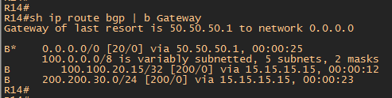

#  BGP Управление анонсами.

###  Задание:

BGP. Фильтрация
Цель: Настроить фильтрацию для офисе Москва
Настроить фильтрацию для офисе С.-Петербург

1. Настроить фильтрацию в офисе Москва так, чтобы не появилось транзитного трафика(As-path)
2. Настроить фильтрацию в офисе С.-Петербург так, чтобы не появилось транзитного трафика(Prefix-list)
3. Настроить провайдера Киторн так, чтобы в офис Москва отдавался только маршрут по-умолчанию
4. Настроить провайдера Ламас так, чтобы в офис Москва отдавался только маршрут по-умолчанию и префикс офиса С.-Петербург

## Предварительная подготовка
1.	Вводим PI адреса в AS1001 (Москва) 100.100.20.0 /24
2.	Вводим PI адреса в AS2042 (Питер) 200.200.30.0 /24
3.	“Заворачиваем“ данные прификсы на интерфейс Null 0 
	 
	   ip route 100.100.20.0 255.255.255.0 Null 0 на роутерах R14 и R15 Москва 
        ip route 200.200.30.0 255.255.255.0 Null 0 на R18 Питер соответственно. 
4.	Анонсируем адресное пространство PI адресов в Москве на обоих роутерах R14 и R15 - network 100.100.20.0 mask 255.255.255.0
5.	Создаем LoopBack интерфейсы на роутерах R14, R15 и R18. 

        R14 IP 100.100.20.14 /32
        R15 IP 100.100.20.15 /32 
        R18 IP 200.200.30.18 /32
6.	Анонсируем сети по BGP 100.100.20.14 /32 на R14 и 100.100.20.15 /32 на R15 для того, чтобы роутеры в Москве знали, как добраться до данных сетей по iBGP
7.	Создадим еще одно eBGP соседство между Киторн и Триада. Роутеры R22 и R23.  Это необходимо сделать в случае отказа канала между Ламас и Триада

## 1. Настроить фильтрацию в офисе Москва так, чтобы не появилось транзитного трафика(As-path).

Для выполнения данного задания в Триада введем подсеть 150.150.150.0 /24 и анонсируем ее по BGP. 

     ip route 100.100.20.0 255.255.255.0 Null 0
     router bgp 520
     network 150.150.150.0 mask 255.255.255.0
     
 Update с анонсом сети прийдет на Ламас и Киторн. Далее Ламас передаст этот Update на Москву R15 и на Киторн. Киторн передаст Update на Ламас и Москву R14. В Москве R15 передаст Update на R14. R14 передаст Update только на Киторн. 
 
 
 
 
 
Как видно из скриншота роутер R14 отдает префиксы для Киторна (50.50.50.1), полученные в Update от R15. Это значит что у Киторна в таблице BGP появится еще один маршрут до сети Триады (150.150.150.0 /24) и до сети Питера (200.200.30.0 /24) через Москву (50.50.50.2) И если откажет линк между Киторном и Триадой или Киторном и Ламасом или на маршрутизаторах провайдера будут специфичные настройки, то Москва будет "транзитом" 

Для предотврашения такой ситуации на роутере R14 создадим

     ip as-path access-list 1 permit ^$
     ip as-path access-list 1 deny .*
     
Далее добавим as-path лист к соседу Киторн R22

     router bgp 1001
     neighbor 50.50.50.1 filter-list 1 out
     
Как видно из скриншотов маршрут через Москву 50.50.50.2 пропал, а роутер R14 стал отдавать только свои анонсированные сети.

 
 
## 2. Настроить фильтрацию в офисе С.-Петербург так, чтобы не появилось транзитного трафика(Prefix-list)

До применения фильтрации на R18 префиксы которые он отдает соседям Триады видны на скриншоте. А это значит, что роутер R18 является транзитным

  

На R18 согласно задания созадим prefix-list.

     ip prefix-list AS2042 seq 5 permit 200.200.30.0/24
     
Далее создадим route-map и будем "матчить" адреса из prefix-list созданного ранее

     route-map AS2042 permit 10
     match ip address prefix-list AS2042
     
Повесим route-map на двух соседей Триады
     
     neighbor 100.100.100.1 route-map AS2042 out
     neighbor 110.110.110.1 route-map AS2042 out
     
Из скриншота видно, что R18 отдает двум соседям только свой префикс PI адресов

     

## 3. Настроить провайдера Киторн так, чтобы в офис Москва отдавался только маршрут по-умолчанию

Необходимо на роутере R22 Киторн смотрящим на соседа Москва 50.50.50.2 выполнить команду:
    
       neighbor 50.50.50.2 default-originate 
 
 Так же на R22 создать prefix-list запрещающий отдавать префиксы Триады и Питера. В BGP "повесить prefix-list на соседа R14 50.50.50.2.
 
      ip prefix-list DENY deny 150.150.150.0/24
      ip prefix-list DENY deny 200.200.200.30/24
       
 Таблица R14 до применения команды
 
   
  
 Таблица R14 после применения команды. Маршрут по умолчанию приходит от R22 Киторн
 
   

## 4. Настроить провайдера Ламас так, чтобы в офис Москва отдавался только маршрут по-умолчанию и префикс офиса С.-Петербург

Необходимо так же как и на роутере R22, на R21 ввести команду

     neighbor 60.60.60.2 default-originate 
     
Так же на R21 создать prefix-list с сетью Питера и в BGP "повесить prefix-list на соседа R15 60.60.60.2. 

     ip prefix-list 1 permit 200.200.30.0/24 - создаем prefix-list
     router bgp 301
     neighbor 60.60.60.2 prefix-list 1 out
 
 Таблица маршрутизации до применения настроек
 
    
   
 Видно, что прилетают префиксы от Питербурга и от Триады.  
 
 
 Таблица маршрутизации после применения настроек
 
    
