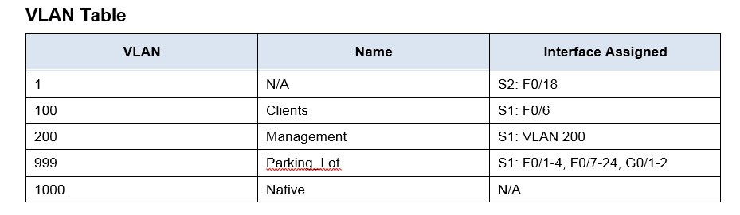

##### Практические работы курса "Сетевой инженер" от OTUS
#  Настройка DHCPv4
###  Схема топологии настраевоемой сети:

###  Таблица адресации настраевоемой сети (желтым выделены IP адреса назначенные на интерфейсы с учетом разделения общей сети):

### Задание разбить сеть 192.168.1.0/24 на 3 сети где:

* По легенде Сеть A включает 58 хостов (the Client VLAN at R1). Сеть A в результате деления 192.168.1.0 mask 255.255.255.192 (64-2 адреса)

* По легенде Сеть B включает 28 хостов (the Management VLAN at R1). Сеть B в результате деления 192.168.1.64 mask 255.255.255.224 (32-2 адреса)

* По легенде Сеть C включает 12 хостов (the VLAN1 at R2). Сеть C в результате деления 192.168.1.96 mask 255.255.255.240 (16-2 адреса)

###  Таблица VLAN:

## Шаг 3 - Шаг 9 включают настройку роутеров и коммутаторов 
    Конфигурация устройств согласно методичке:
- [Конфигурационные файлы;](config/)

### Вопрос к шагу 8
* Why is interface F0/5 listed under VLAN 1? (Почему интерфейс Fa0/5 указан в VLAN1)

      Ответ: Если имеется ввиду интерфейс коммутатора который смотрит в сторону маршрутизатора R2 то данный интерфейс остался в VLAN1 по причини того, что порт маршрутизатора, согласно методичке, настроен без использования инкапсуляции и коммутатору нет необходимости помечать трафик дополнительным тегом. По умолчанию трафик принадлжежащий VLAN1 (Native) выходит из интерфейса без дополнительного тега.
      
# Часть 2
## Шаг 1. Configure R1 with DHCPv4 pools for the two supported subnets. 
### a. Exclude the first five useable addresses from each address pool.
    ip dhcp excluded-address 192.168.1.1 192.168.1.5
    ip dhcp excluded-address 192.168.1.97 192.168.1.101
    
    
 ### Пункты b-g отражены в конфигах ниже:
Для сети A
 
    ip dhcp pool Clients
    network 192.168.1.0 255.255.255.192
    default-router 192.168.1.1
    dns-server 192.168.1.1
    domain-name ccna-lab.com
   
Для сети C 

    ip dhcp pool R2_Client_LAN
    network 192.168.1.96 255.255.255.240
    default-router 192.168.1.97
    dns-server 192.168.1.97
    domain-name ccna-lab.com
    
## Шаг 3 Verify the DHCPv4 Server configuration
### Пункты a-c отражены в скриншотах ниже:

******************************************

## Шаг 4
### Пункты a-c отражены в скриншоте ниже:

# Часть 3
## Шаг 1
Согласно инструкции задаем на маршрутизаторе R2 ip helper-address в настройках интерфейса Gi0/1 

    interface GigabitEthernet0/1
    ip address 192.168.1.97 255.255.255.240
    ip helper-address 10.0.0.1
    duplex auto
    speed auto
    
## Шаг 2    
### Пункты a-c отражены в скриншоте ниже:

