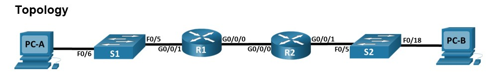
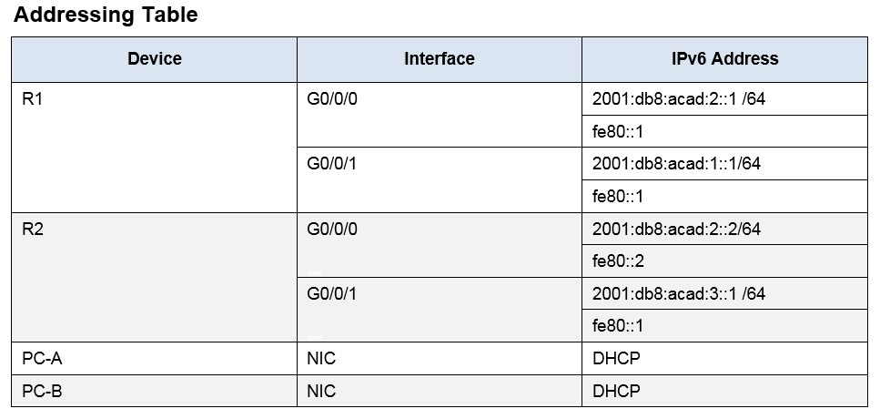
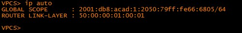
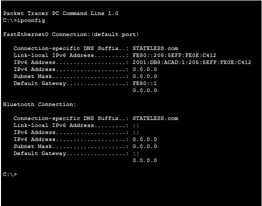

##### Практические работы курса "Сетевой инженер" от OTUS
#  Настройка DHCPv6
###  Схема топологии настраевоемой сети:

###  Таблица адресации настраевоемой сети

## Шаг 1 - Шаг 4 включают настройку роутеров и коммутаторов 
    Конфигурация устройств согласно методичке:
- [Конфигурационные файлы;](config/)

      Работа выполнялась частично в Cisco PCT и EVE-NG. Из-за ограничений в PCT пришлось выполнять работу в EVE-NG
      В данном задании выполнялись настройки по пунктам указанным в методичке .
      Итог отражен на скриншотах. PC_A и PC_B получили адрес по SLAAC и настройки DNS по DHCP. 
      VirtualPC которые есть в EVE-NG не могут показать настройки по назначению DNS поэтому приложен скриншот из Cisco PCT для PC_A
      Скриншот для Cisco PCT для PC_B отсутвует так как в нем не удалось выполнить до конца условия задачи, а именно отсутвует команда R2(config-if)# ipv6 dhcp relay.......destination 2001:db8:acad:2::1 gi0/0

* PC-A

* PC-B

* Скриншот Cisco PCT

