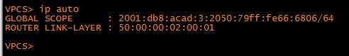

##### Практические работы курса "Сетевой инженер" от OTUS
#  Настройка DHCPv6
###  Схема топологии настраевоемой сети:

###  Таблица адресации настраевоемой сети

## Шаг 1 - Шаг 4 включают настройку роутеров и коммутаторов 
    Конфигурация устройств согласно методичке:
- [Конфигурационные файлы;](config/)

Работа выполнялась частично в Cisco PCT и EVE-NG. В PCT нет команды
В данном задании выполнялись настройки по пунктам указанным в методичке .
Итог отражен на скриншотах. ПК A и ПК B получили адрес по SLAAC и настройки DNS по DHCP. 
VirtualPC которые есть в EVE-NG не могут показать настройки по назначению DNS поэтому приложен скриншот из Cisco PCT

* PC-A

* PC-B

