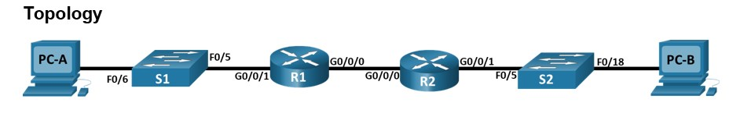
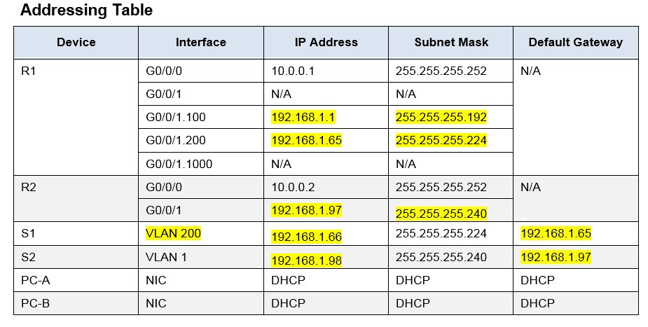
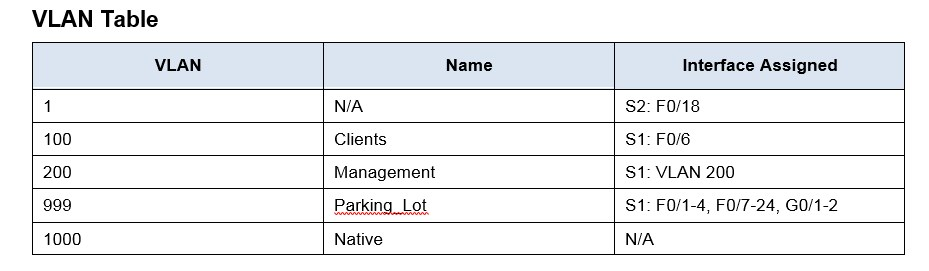

##### Практические работы курса "Сетевой инженер" от OTUS
#  Настройка DHCPv4
###  Схема топологии настраевоемой сети:

###  Таблица адресации настраевоемой сети (желтым выделены разделенные сети):

### Задание разбить сеть 192.168.1.0/24 на 3 сети где:

* По легенде Сеть A включает 58 хостов (the Client VLAN at R1). Сеть A в результате деления 192.168.1.0 mask 255.255.255.192 (64-2 адреса)

* По легенде Сеть B включает 28 хостов (the Management VLAN at R1). Сеть B в результате деления 192.168.1.64 mask 255.255.255.224 (32-2 адреса)

* По легенде Сеть C включает 12 хостов (the VLAN1 at R2). Сеть C в результате деления 192.168.1.96 mask 255.255.255.240 (16-2 адреса)

###  Таблица VLAN:

## Шаг 3 - Шаг 9 включают настройку роутеров и коммутаторов 
    Конфигурация устройств согласно методичке:
- [Конфигурационные файлы;](config/)
