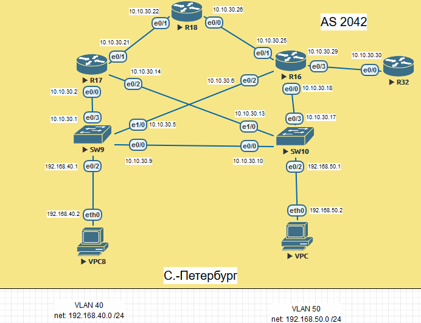
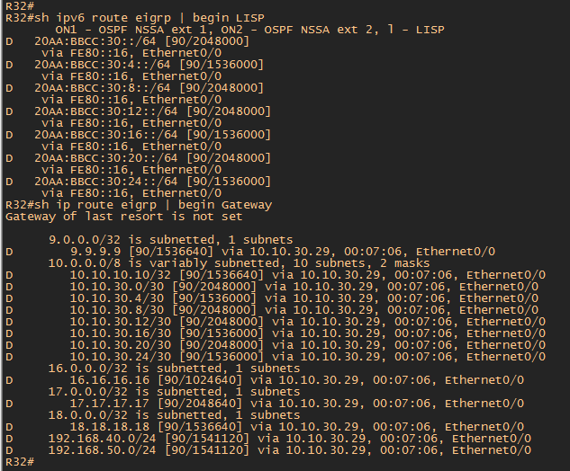

#  EIGRP

###  Задание:

Цель: Настроить EIGRP в С.-Петербург;
Использовать named EIGRP
1. В офисе С.-Петербург настроить EIGRP
2. R32 получает только маршрут по-умолчанию
3. R16-17 анонсируют только суммарные префиксы
4. Использовать EIGRP named-mode для настройки сети

Настройка осуществляется одновременно для IPv4 и IPv6

- [Конфигурационные файлы](config/)

### Схема сети

### Адресация в офисе Санкт-Питербург

Санкт-Питербург (AS 2042).

| Network IPv4     | Summary net    | Network IPv6             | Summary net         | Description   | Eq&port          |
|-----------------:|:---------------|-------------------------:|:--------------------|:-------------:|------------------|
| 10.10.30.0/30    | 10.10.30.0/24  | 20AA:BBCC:30:0::/64      | 20AA:BBCC:20::/48   | Питер AS 2042 | SW9e0/3  R17e0/0 |
| 10.10.30.4/30    | 10.10.30.0/24  | 20AA:BBCC:30:4::/64      | 20AA:BBCC:20::/48   | Питер AS 2042 | SW9e1/0  R16e0/2 |
| 10.10.30.8/30    | 10.10.30.0/24  | 20AA:BBCC:30:8::/64      | 20AA:BBCC:20::/48   | Питер AS 2042 | SW10e1/0 R17e0/2 |
| 10.10.30.12/30   | 10.10.30.0/24  | 20AA:BBCC:30:12::/64     | 20AA:BBCC:20::/48   | Питер AS 2042 | SW10e0/3 R16e0/0 |
| 10.10.30.16/30   | 10.10.30.0/24  | 20AA:BBCC:30:16::/64     | 20AA:BBCC:20::/48   | Питер AS 2042 | R17e0/1  R18e0/1 |
| 10.10.30.20/30   | 10.10.30.0/24  | 20AA:BBCC:30:20::/64     | 20AA:BBCC:20::/48   | Питер AS 2042 | R16e0/1  R18e0/0 |
| 10.10.30.24/30   | 10.10.30.0/24  | 20AA:BBCC:30:24::/64     | 20AA:BBCC:20::/48   | Питер AS 2042 | R16e0/3  R32e0/0 |

| Equip | Port | AddrTyp | Address                  | Network                | Description     |
|-------|------|---------|--------------------------|------------------------|-----------------|
|	R18	|	e0/0	|	IPv4		|	10.10.30.22	|	10.10.10.20/30	|	to	R16	e0/1	|
|	R18	|	e0/0	|	IPv6		|	20AA:BBCC:30:20::22/64	|	20AA:BBCC:30:20::/64	|	to	R16	e0/1	|
|	R18	|	e0/0	|	IPv6	LL	|	FE80::18	|	FE80::/10	|	to	R16	e0/1	|
|	R18	|	e0/1	|	IPv4		|	10.10.30.18	|	10.10.30.16/30	|	to	R17	e0/1	|
|	R18	|	e0/1	|	IPv6		|	20AA:BBCC:30:16::18/64	|	20AA:BBCC:30:16:::/64	|	to	R17	e0/1	|
|	R18	|	e0/1	|	IPv6	LL	|	FE80::18	|	FE80::/10	|	to	R17	e0/1	|
|	R18	|	e0/2	|	IPv4		|	100.100.100.2	|	100.100.100.0/28	|	to	R24	e0/3	|
|	R18	|	e0/2	|	IPv6		|	20AA:BBCC:100:100::2/64	|	20AA:BBCC:100:100::/64	|	to	R24	e0/3	|
|	R18	|	e0/2	|	IPv6	LL	|	FE80::18	|	FE80::/10	|	to	R24	e0/3	|
|	R18	|	e0/3	|	IPv4		|	110.110.110.2	|	110.110.110.0/28	|	to	R26	e0/3	|
|	R18	|	e0/3	|	IPv6		|	20AA:BBCC:110:110::2/64	|	20AA:BBCC:110:110::/64	|	to	R26	e0/3	|
|	R18	|	e0/3	|	IPv6	LL	|	FE80::18	|	FE80::/10	|	to	R26	e0/3	|
|	R17	|	e0/0	|	IPv4		|	10.10.30.2	|	10.10.10.0/30	|	to	SW9	e0/3	|
|	R17	|	e0/0	|	IPv6		|	20AA:BBCC:30::2/64	|	20AA:BBCC:30::/64	|	to	SW9	e0/3	|
|	R17	|	e0/0	|	IPv6	LL	|	FE80::17	|	FE80::/10	|	to	SW9	e0/3	|
|	R17	|	e0/1	|	IPv4		|	10.10.30.17	|	10.10.30.16/30	|	to	R18	e0/1	|
|	R17	|	e0/1	|	IPv6		|	20AA:BBCC:30:16::17/64	|	20AA:BBCC:30:16::/64	|	to	R18	e0/1	|
|	R17	|	e0/1	|	IPv6	LL	|	FE80::17	|	FE80::/10	|	to	R18	e0/1	|
|	R17	|	e0/2	|	IPv4		|	10.10.30.10	|	10.10.30.8/30	|	to	SW10	e1/0	|
|	R17	|	e0/2	|	IPv6		|	20AA:BBCC:30:8::10/64	|	20AA:BBCC:30:8::/64	|	to	SW10	e1/0	|
|	R17	|	e0/2	|	IPv6	LL	|	FE80::17	|	FE80::/10	|	to	SW10	e1/0	|
|	R16	|	e0/0	|	IPv4		|	10.10.30.14	|	10.10.10.12/30	|	to	SW10	e0/3	|
|	R16	|	e0/0	|	IPv6		|	20AA:BBCC:30:12::14/64	|	20AA:BBCC:30:12::/64	|	to	SW10	e0/3	|
|	R16	|	e0/0	|	IPv6	LL	|	FE80::16	|	FE80::/10	|	to	SW10	e0/3	|
|	R16	|	e0/1	|	IPv4		|	10.10.30.21	|	10.10.30.20/30	|	to	R18	e0/0	|
|	R16	|	e0/1	|	IPv6		|	20AA:BBCC:30:20::21/64	|	20AA:BBCC:30:20:::/64	|	to	R18	e0/0	|
|	R16	|	e0/1	|	IPv6	LL	|	FE80::16	|	FE80::/10	|	to	R18	e0/0	|
|	R16	|	e0/2	|	IPv4		|	10.10.30.6	|	10.10.30.4/30	|	to	SW9	e1/0	|
|	R16	|	e0/2	|	IPv6		|	20AA:BBCC:30:4::6/64	|	20AA:BBCC:30:4::/64	|	to	SW9	e1/0	|
|	R16	|	e0/2	|	IPv6	LL	|	FE80::16	|	FE80::/10	|	to	SW9	e1/0	|
|	R16	|	e0/3	|	IPv4		|	10.10.30.25	|	10.10.30.24/32	|	to	R32	e0/0	|
|	R16	|	e0/3	|	IPv6		|	20AA:BBCC:30:24::25/64	|	20AA:BBCC:30:24::/64	|	to	R32	e0/0	|
|	R16	|	e0/3	|	IPv6	LL	|	FE80::16	|	FE80::/10	|	to	R32	e0/0	|
|	R32	|	e0/3	|	IPv4		|	10.10.30.26	|	10.10.30.24/32	|	to	R16	e0/3	|
|	R32	|	e0/3	|	IPv6		|	20AA:BBCC:30:24::26/64	|	20AA:BBCC:30:24::/64	|	to	R16	e0/3	|
|	R32	|	e0/3	|	IPv6	LL	|	FE80::32	|	FE80::/10	|	to	R16	e0/3	|
|	SW9	|	e0/3	|	IPv4		|	10.10.30.1	|	10.10.10.0/30	|	to	R17	e0/0	|
|	SW9	|	e0/3	|	IPv6		|	20AA:BBCC:30::1/64	|	20AA:BBCC:30::/64	|	to	R17	e0/0	|
|	SW9	|	e0/3	|	IPv6	LL	|	FE80::9	|	FE80::/10	|	to	R17	e0/0	|
|	SW9	|	e1/0	|	IPv4		|	10.10.30.5	|	10.10.30.4/30	|	to	R16	e0/2	|
|	SW9	|	e1/0	|	IPv6		|	20AA:BBCC:30:4:5/64	|	20AA:BBCC:30:4:::/64	|	to	R16	e0/2	|
|	SW9	|	e1/0	|	IPv6	LL	|	FE80::9	|	FE80::/10	|	to	R16	e0/2	|
|	SW9	|	PO1 L3	|	IPv4		|	10.10.30.29	|	10.10.30.28/30	|	to	SW10	e0/0-1	|
|	SW9	|	PO1 L3	|	IPv6		|	none	|	none	|	to	SW10	e0/0-1	|
|	SW9	|	PO1 L3	|	IPv6	LL	|	none	|	none	|	to	SW10	e0/0-1	|
|	SW9	|	SVI	|	IPv4		|	192.168.40.1	|	192.168.40.0/24	|	to	VPC8	eth0/0	|
|	SW10	|	e0/3	|	IPv4		|	10.10.30.13	|	10.10.10.12/30	|	to	R16	e0/0	|
|	SW10	|	e0/3	|	IPv6		|	20AA:BBCC:30:12::13/64	|	20AA:BBCC:30:12::/64	|	to	R16	e0/0	|
|	SW10	|	e0/3	|	IPv6	LL	|	FE80::10	|	FE80::/10	|	to	R16	e0/0	|
|	SW10	|	e1/0	|	IPv4		|	10.10.30.9	|	10.10.30.8/30	|	to	R17	e0/2	|
|	SW10	|	e1/0	|	IPv6		|	20AA:BBCC:30:8:9/64	|	20AA:BBCC:30:8:::/64	|	to	R17	e0/2	|
|	SW10	|	e1/0	|	IPv6	LL	|	FE80::10	|	FE80::/10	|	to	R17	e0/2	|
|	SW10	|	PO1 L3	|	IPv4		|	10.10.30.30	|	10.10.30.28/30	|	to	SW9	e0/0-1	|
|	SW10	|	PO1 L3	|	IPv6		|	none	|	none	|	to	SW9	e0/0-1	|
|	SW10	|	PO1 L3	|	IPv6	LL	|	none	|	none	|	to	SW9	e0/0-1	|
|	SW10	|	SVI	|	IPv4		|	192.168.50.1	|	192.168.50.0/24	|	to	VPC	eth0/0	|

### Конфигурация маршрутизаторов сводиться к следующим настройкам:

1. Включаем на всех роутерах процес EIGRP в режиме Named Mode. 
          
       RX(config)#router eigrp PITER - команда включает процес EIGRP в named mode с именем PITER на всех роутрах. 
 
2. Производим настройку динамической маршрутизации для IPv4 и IPv6 и добавляем Router ID

       RX(config-router)#address-family ipv4 unicast autonomous-system 100
       RX(config-router)#address-family ipv6 unicast autonomous-system 100
       RX(config-router-af)#eigrp router-id x.x.x.x
       
       
3. Интерфейсы роутеров добавляем к анонсу EIGRP IPv4 (применительно только для IPv4, для IPv6 задана по умолчанию) 
 
       RX(config-router-af)#network 0.0.0.0
       
4.  Следующая команда позволяет задать общие настройки для всех интерфейсов учавствующих в обмене EIGRP пакетами.

        RX(config-router-af)#af-interface default
        
5.  Данная команда отключает процес обмена EIGRP пакетами на всех интерфейсах.

        RX(config-router-af-interface)#shutdown
        
        RX(config-router-af)#af-interface ethernet x/z - вход в настройку интерфейса учавствующего в обмене EIGRP пакетами.
        RX(config-router-af)#no shutdown - включаем обмен EIGRP пакетами конкретно на необходимом интерфейсе
        
        
       
 ### После введенных настроек таблица маршрутизации на всех роутерах выглядит следующим образом.
 
 
 
 Для примера использован маршрутизатор R16.
Сети LoopBack 30.30.30.X где X это цифра номера маршрутизатора согласно схемы.

     
     

