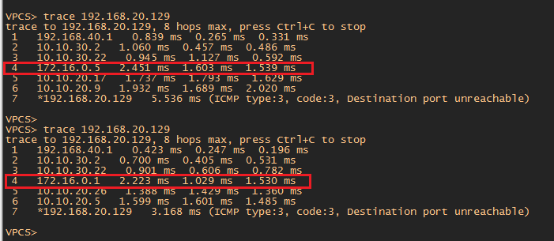

#  Виртуальная частные сети - VPN .

###  Задание:

Цель: Настроить GRE между офисами Москва и С.-Петербург

Настроить DMVPN между офисами Москва и Чокурдах, Лабытнанги

1. Настроите GRE между офисами Москва и С.-Петербург
2. Настроите DMVMN между Москва и Чокурдах, Лабытнанги

- [Конфигурационные файлы;](config/)

## 1. Настроите GRE между офисами Москва и С.-Петербург.

 1. На роутере R15 создать интерфейс Tunnel 0 и выполнить настройки для создания GRE туннеля с Питером R18

        interface Tunnel0
        ip address 172.16.0.1 255.255.255.252 - адрес подсети для туннеля
        ip mtu 1400
        ip tcp adjust-mss 1360
        tunnel source 100.100.20.15 - PI адрес AS1001 Москва
        tunnel destination 200.200.30.18 - PI адрес AS2042 Питер

 2. На роутере R18 создать интерфейс Tunnel 0 и выполнить настройки для создания GRE туннеля с Москвой R15

        interface Tunnel0
        ip address 172.16.0.2 255.255.255.252 - адрес подсети для туннеля
        ip mtu 1400
        ip tcp adjust-mss 1360
        keepalive 10 3 - команда для отслеживания работоспособности туннеля. Применение данной команды будет объяснено далее
        tunnel source 200.200.30.18 - PI адрес AS2042 Питер
        tunnel destination 100.100.20.15 - PI адрес AS1001 Москва
        
  3. На роутерах Москвы R15 и Питера R18 прописать статические маршруты до сетей офиса
  
         R15 ip route 192.168.40.0 255.255.255.0 Tunnel0 - сеть 192.168.40.0 сеть Питера
         R15 ip route 192.168.50.0 255.255.255.0 Tunnel0 - сеть 192.168.40.0 сеть Питера
         
         R18 ip route 192.168.20.0 255.255.255.0 Tunnel0 - сеть 192.168.20.0 сеть Москвы
         R18 ip route 192.168.30.0 255.255.255.0 Tunnel0 - сеть 192.168.40.0 сеть Москвы
         
  Пропингуем с ПК Питера имеющего адрес 192.168.40.2 адрес ПК Москвы 192.168.20.129
  
  
  
  Как видно из скриншота пинг удачно проходит и маршрут идет по туннелю 172.16.0.1 (цифра 4 в trace)
  
  Но если роутер R15 Москва по каким-либо причинам будет не доступен, то VPN канал "развалится" и офисные сети перестанут быть доступны между собой.
  Для этого создадим дополнительный туннель между R14 Москва и так же R18 Питер
  
  4. На роутере R14 создать интерфейс Tunnel 0 и выполнить настройки для создания GRE туннеля с Питером R18
  
         interface Tunnel0
         ip address 172.16.0.5 255.255.255.252 адрес подсети для туннеля
         ip mtu 1400
         ip tcp adjust-mss 1360
         tunnel source 100.100.20.14 - PI адрес AS1001 Москва
         tunnel destination 200.200.30.18 - PI адрес AS2042 Питер
  
  5. На роутере R18 создать интерфейс Tunnel 1 (это второй туннель на этом роутере) и выполнить настройки для создания GRE туннеля с Москвой R14
         
         interface Tunnel1
         ip address 172.16.0.6 255.255.255.252
         ip mtu 1400
         ip tcp adjust-mss 1360
         tunnel source 200.200.30.18 - PI адрес AS2042 Питер
         tunnel destination 100.100.20.14 - PI адрес AS1001 Москва
         
   6. На роутерах Москвы R14 и Питера R18 прописать статические маршруты до сетей офиса.

          R14 ip route 192.168.40.0 255.255.255.0 Tunnel0 - сеть 192.168.40.0 сеть Питера
          R14 ip route 192.168.50.0 255.255.255.0 Tunnel0 - сеть 192.168.40.0 сеть Питера
          
      По скольку на R18 Питер уже прописаны статические маршруты до сетей офиса Москвы через Tunnel0, то необходимо прописать маршруты до этих сетей через Tunnel1 c более худшей метрикой (10)  
      
          R18 ip route 192.168.20.0 255.255.255.0 Tunnel1 10 - сеть 192.168.20.0 сеть Москвы 
          R18 ip route 192.168.30.0 255.255.255.0 Tunnel1 10 - сеть 192.168.30.0 сеть Москвы 
          
   Теперь на роутере R18 по два маршрута в каждую сеть, но в таблицу маршрутизации попадет маршрут с более лучшей метрикой. 
   
   

  Команда "keepalive 10" прописанная ранее на R18 в конфиге Tunnel0 необходима для того, что бы каждые 10 секунд посылать ICMP запрос на R15. Т.е тем самым    проверяется работоспособность туннеля между R18 и R15. И если R15 становится недоступным, то на R18 появляется диагностическое сообщение
%LINEPROTO-5-UPDOWN: Line protocol on Interface Tunnel0, changed state to DOWN

   
   
 На скриншоте выше в таблице маршрутизации R18 трафик до сетей офиса Москвы шел через Tunnel0. Далее R15 перестал быть доступным и появилось сообщение LINEPROTO-5-UPDOWN: Line protocol on Interface Tunnel0, changed state to down. Таблица маршрутизации до офиса Москвы изменилась и трафик пошел на Tunnel1. Затем R15 стал доступен и появилось диагностическое сообщение %LINEPROTO-5-UPDOWN: Line protocol on Interface Tunnel0, changed state to UP. Трафик снова пошел через Tunnel0
 
 Так же видно что ПК из офиса Питера после падения канала между R15 и R18 стал идти через 172.16.0.5, а после восстановления канала снова стал идти через 172.16.0.1
 
 
