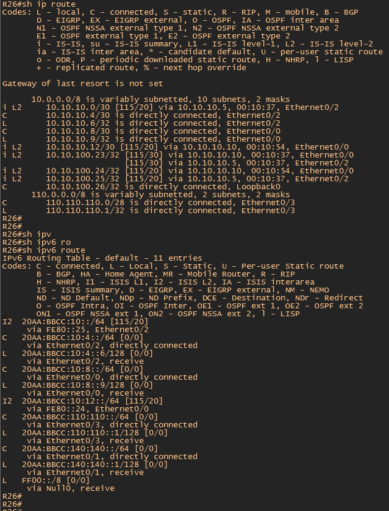

#  IS-IS

###  Задание:

Цель: Настроить IS-IS офисе Триада
1. Настроите IS-IS в ISP Триада
2. R23 и R25 находятся в зоне 2222
3. R24 находится в зоне 24
4. R26 находится в зоне 26

Настройка осуществляется одновременно для IPv4 и IPv6

- [Конфигурационные файлы](config/)

### Схема сети

Адресация в офисе Триада

Триада (AS 520).

| Network IPv4     | Summary net    | Network IPv6             | Summary net         | Description   | Eq&port         |
|-----------------:|:---------------|-------------------------:|:--------------------|:-------------:|-----------------|
| 10.10.10.0/30    | 10.10.10.0/24  | 20AA:BBCC:10:0::/64      | 20AA:BBCC:10::/48   | Триада AS 520 | R23e0/1 R25e0/0 |
| 10.10.10.4/30    | 10.10.10.0/24  | 20AA:BBCC:10:4::/64      | 20AA:BBCC:10::/48   | Триада AS 520 | R25e0/2 R26e0/2 |
| 10.10.10.8/30    | 10.10.10.0/24  | 20AA:BBCC:10:8::/64      | 20AA:BBCC:10::/48   | Триада AS 520 | R26e0/0 R24e0/1 |
| 10.10.10.12/30   | 10.10.10.0/24  | 20AA:BBCC:10:12::/64     | 20AA:BBCC:10::/48   | Триада AS 520 | R23e0/2 R24e0/2 |

| Equip | Port | AddrTyp | Address                  | Network                | Description     |
|-------|------|---------|--------------------------|------------------------|-----------------|
|	R23	|	e0/1	|	IPv4		|	10.10.10.1	|	10.10.10.0/30	|	to	R25	e0/0	|
|	R23	|	e0/1	|	IPv6		|	20AA:BBCC:10:::1/64	|	20AA:BBCC:10:::/64	|	to	R25	e0/0	|
|	R23	|	e0/1	|	IPv6	LL	|	FE80::23	|	FE80::/10	|	to	R125	e0/0	|
|	R23	|	e0/2	|	IPv4		|	10.10.10.14	|	10.10.10.12/30	|	to	R24	e0/2	|
|	R23	|	e0/2	|	IPv6		|	20AA:BBCC:10:12::14/64	|	20AA:BBCC:10:12::/64	|	to	R24	e0/2	|
|	R23	|	e0/2	|	IPv6	LL	|	FE80::23	|	FE80::/10	|	to	R24	e0/2	|
|	R24	|	e0/1	|	IPv4		|	10.10.10.10	|	10.10.10.8/30	|	to	R26	e0/0	|
|	R24	|	e0/1	|	IPv6		|	20AA:BBCC:10:8::10/64	|	20AA:BBCC:10:8:::/64	|	to	R26	e0/0	|
|	R24	|	e0/1	|	IPv6	LL	|	FE80::24	|	FE80::/10	|	to	R26	e0/0	|
|	R24	|	e0/2	|	IPv4		|	10.10.10.13	|	10.10.10.12/30	|	to	R23	e0/2	|
|	R24	|	e0/2	|	IPv6		|	20AA:BBCC:10:12::13/64	|	20AA:BBCC:10:12::/64	|	to	R23	e0/2	|
|	R24	|	e0/2	|	IPv6	LL	|	FE80::24	|	FE80::/10	|	to	R23	e0/2	|
|	R25	|	e0/0	|	IPv4		|	10.10.10.2	|	10.10.10.0/30	|	to	R23	e0/1	|
|	R25	|	e0/0	|	IPv6		|	20AA:BBCC:10::2/64	|	20AA:BBCC:10::/64	|	to	R23	e0/1	|
|	R25	|	e0/0	|	IPv6	LL	|	FE80::25	|	FE80::/10	|	to	R23	e0/1	|
|	R25	|	e0/2	|	IPv4		|	10.10.10.5	|	10.10.10.4/30	|	to	R26	e0/2	|
|	R25	|	e0/2	|	IPv6		|	20AA:BBCC:10:4::5/64	|	20AA:BBCC:10:4::/64	|	to	R26	e0/2	|
|	R25	|	e0/2	|	IPv6	LL	|	FE80::25	|	FE80::/10	|	to	R26	e0/2	|
|	R26	|	e0/0	|	IPv4		|	10.10.10.9	|	10.10.10.8/30	|	to	R24	e0/1	|
|	R26	|	e0/0	|	IPv6		|	20AA:BBCC:10:8::9/64	|	20AA:BBCC:10:8::/64	|	to	R24	e0/1	|
|	R26	|	e0/0	|	IPv6	LL	|	FE80::26	|	FE80::/10	|	to	R24	e0/1	|
|	R26	|	e0/2	|	IPv4		|	10.10.10.6	|	10.10.10.4/30	|	to	R25	e0/2	|
|	R26	|	e0/2	|	IPv6		|	20AA:BBCC:10:4::6/64	|	20AA:BBCC:10:4::/64	|	to	R25	e0/2	|
|	R26	|	e0/2	|	IPv6	LL	|	FE80::26	|	FE80::/10	|	to	R25	e0/2	|

### Конфигурация маршрутизаторов сводиться к следующим настройкам:

1. Включаем на роутере процес IS-IS 
          
       RX(config)#router isis
 
2. Согласно задания номер 2-4 назначаем Network Entity Title для каждого маршрутизатора

       R23(config-router)#net 49.2222.0023.0023.0023.00
       R24(config-router)#net 49.0024.0024.0024.0024.00
       R25(config-router)#net 49.2222.0025.0025.0025.00
       R26(config-router)#net 49.0026.0026.0026.0026.00
       
       
3. Интерфейсы роутеров добавляем к анонсу IS-IS IPv4 и IPv6 
 
       RX(config-if)#ip router isis
       RX(config-if)#ipv6 router isis
 

По умолчанию на роутерах Cisco протокол IS-IS работает в режиме L1/L2. Соотвественно роутеры находящиеся в одной зоне буду генерировать по 2 LSP т.е LSP L1 и LSP L2.
Такими роутерами являются R23 и R25. 

В данной топологии нет необходимости в генерации LSP Type L2 между роутерами R23 и R25. Но глобально нельзя перевести роутеры R23 и R25 в режим работы L1 так как маршрутизация между зонами осуществляется по L2. Для решения задачи необходимо на интерфейсах маршрутизавтора задать режим L1.

     R23(config-if)#isis circuit-type level-1 - интерфейс e0/1
     R25(config-if)#isis circuit-type level-1 - интерфейс e0/0
     
 После введенных команд таблица соседей выглядит следующим образом

    

В данном примере показана таблица маршрутизации роутера R23. Как видно из скриншота в таблице появились динамические маршруты IS-IS.

Это сети Loopback интерфейсов

     i L2     10.10.100.24/32 [115/20] via 10.10.10.13, 00:00:37, Ethernet0/2
     i L1     10.10.100.25/32 [115/20] via 10.10.10.2, 00:00:21, Ethernet0/1
     i L2     10.10.100.26/32 [115/30] via 10.10.10.13, 00:00:07, Ethernet0/2

