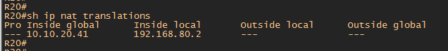
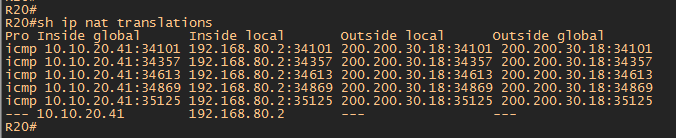
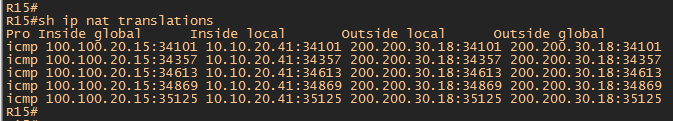
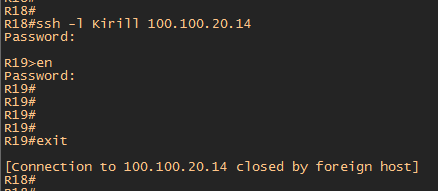
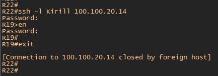
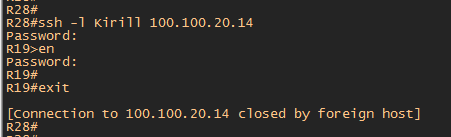
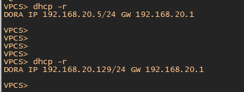
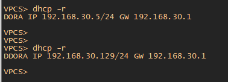

#  Основные протоколы сети интернет.

###  Задание:

Настроить DHCP в офисе Москва
Настроить синхронизацию времени в офисе Москва
Настроить NAT в офисе Москва, C.-Перетбруг и Чокурдах

1. Настроите NAT(PAT) на R14 и R15. Трансляция должна осуществляться в адрес автономной системы AS1001
2. Настроите NAT(PAT) на R18. Трансляция должна осуществляться в пул из 5 адресов автономной системы AS2042
3. Настроите статический NAT для R20
4. Настроите NAT так, чтобы R19 был доступен с любого узла для удаленного управления

5*. Настроите статический NAT(PAT) для офиса Чокурдах
6. Настроите для IPv4 DHCP сервер в офисе Москва на маршрутизаторах R12 и R13. VPC1 и VPC7 должны получать сетевые настройки по DHCP
7. Настроите NTP сервер на R12 и R13. Все устройства в офисе Москва должны синхронизировать время с R12 и R13

## 1. Настроите NAT(PAT) на R14 и R15. Трансляция должна осуществляться в адрес автономной системы AS1001.

1. На роутерах R14 и R15 создадим access-list для подсетей офиса Москва (192.168.20.0 /24 и 192.168.30.0 /24)

       access-list 1 permit 192.168.0.0 0.0.255.255
       
2. На роутерах R14 и R15: 

   назначим интерфейсы e0/0 как ip nat inside

   назначим интерфейсы e0/2 как ip nat outside

3. На роутерах R14 и R15 создадим запись для Nat трансляции согласно задания

       ip nat inside source list 1 interface Loopback1 overload
       
    Loopback1 это PI адреса AS1001

    для R14 LoppBack1 100.100.100.14 /32

    для R15 LoppBack1 100.100.100.15 /32
    
    "Пропингуем" с офиса Москвы с ПК (192.168.20.4) роутер Питера R18 на интерфейсе которого настроен белый IP из диапозона PI адресов AS2042 Питер (200.200.30.18 /32)
    
    
    
    На роутере R15 появилась запись в NAT трансляции
    
    
    
    Выход в Интернет осуществляется через роутер R15 согласно предыдущих заданий. Для проверки R14, отключим R15 и убедимся, что NAT рансляция так же проходит через R14
    
    

##  2. Настроите NAT(PAT) на R18. Трансляция должна осуществляться в пул из 5 адресов автономной системы AS2042

   1. На роутере R18 Питер создадим access-list для подсетей офиса Питер (192.168.40.0 /24 и 192.168.50.0 /24)

          access-list 1 permit 192.168.0.0 0.0.255.255
    
   2. Создадим LoopBack2 с IP адресом 200.200.30.1 /29.  Данная сеть включает 6 IP, что удовлетворяет услвоию задания.
    
          interface Loopback2
          ip address 200.200.30.1 255.255.255.248 
   
   3. Создадим Pool для 5 NAT адресов
   
          ip nat pool AS_2042 200.200.30.2 200.200.30.6 netmask 255.255.255.248
          
   4. Создадим NAT трансляицю  
   
          ip nat inside source list 1 pool AS_2042 overload
          
   5. На роутере R18: 

   назначим интерфейсы e0/0 и e0/1 как ip nat inside

   назначим интерфейсы e0/2 и e0/3 как ip nat outside 
   
   "Пропингуем" с офиса Питера с ПК (192.168.40.2) роутер Москвы R15 на интерфейсе которого настроен белый IP из диапозона PI адресов AS1001 Москва (100.100.20.15 /32)
   
   
   
  NAT трансляция на роутере R18 Питер 
  
   

##  3.Настроите статический NAT для R20

   1. Введем в схему еще одну подсеть офиса 192.168.80.0 /24 и "повесим" ее на интерфейс роутера R20.
   
   
   
     interface Ethernet0/1
     ip address 192.168.80.1 255.255.255.0
     ip nat inside
     
   2. На интерфейсе e0/0 роутера R20 добавим второй IP адрес (secondary). Это необходимо для того, что бы NAT трансляция осуществлялась через IP secondary адрес. Если выполнить трансляцию через основной адрес, который учавствует в OSPF, то это вызовет проблемы с соседством по OSPF 

            
    interface Ethernet0/0
    ip address 10.10.20.41 255.255.255.252 secondary
    ip address 10.10.20.38 255.255.255.252
    ip nat outside
  
  3. На R20 cоздадим статическую NAT трансляицю
  
    ip nat inside source static 192.168.80.2 10.10.20.41
     
   
    
   4. Для того, что бы из подсети 192.168.80.0 можно было обращаться в интернет, нужно выполнить дополнительную настройку на роутере R15, а именно:
   
      создать еще один access-list для подсети в которую входит secondary адрес роутера R20
      
          access-list 2 permit 10.10.20.40 0.0.0.3
      
      создать NAT трансляцию для этого access-list
      
          ip nat inside source list 2 interface Loopback1 overload 
          
       Интерфейс e0/3 роутера R15 сделать как ip nat inside
     
   То есть я сделал двойной NAT.  Пакет из сети 192.168.80.0 НАТИТСЯ в IP Secondary R20 через статический NAT и далее попадая на интерфейс роутера R15 так же НАТИТСЯ в адрес Loopback1. Это белый PI адреc R15 (100.100.20.15 /32).
   
   
   
   
   
 ##  4. Настроите NAT так, чтобы R19 был доступен с любого узла для удаленного управления 

Для выполнения это задания необходимо на роутере R14 прописать команду перенаправления портов

     ip nat inside source static tcp 19.19.19.19 22 100.100.20.14 22 extendable
     
В качестве Local адреса использован Loopback интерфейс 19.19.19.19

Далее необходимо так же на роутере R14 прописать интерфейс e0/3 смотрящий на R19 как ip nat inside

    interface Ethernet0/3
    ip nat inside
    
и интерфейс e0/1 смотрящий на R15 как ip nat outside. Это необходимо так как трафик в Интернет идет через R15 согласно предыдущего задания и все роутеры в Интернет поcылают так же трафик на R15.  

    interface Ethernet0/1
    ip nat outside
    
 Предварительно на R19 я создал пользователя и разрешил доступ по SSH. 
 
 Проверяем доступность к R19 c роутера R18 Питер
 
  
  
  Проверяем доступность к R19 c роутера R22 Киторн
 
  
  
  Проверяем доступность к R19 c роутера R28 Чокурдах
 
  
  
  
 ##  6. Настроите для IPv4 DHCP сервер в офисе Москва на маршрутизаторах R12 и R13. VPC1 и VPC7 должны получать сетевые настройки по DHCP

   1. На роутерах R12 и R13 исключаем адреса для автоматической выдачи по DHCP
  
  Для роутера R12 делаем исключение 
  
  для сети LAN_20
 
      ip dhcp excluded-address 192.168.20.1 192.168.20.3 - исключаем шлюз (1) и адреса FHRP (2-3)
      ip dhcp excluded-address 192.168.20.128 192.168.20.254 - исключаем диапозон адресов который будет выдавать второй dhcp сервер на R13 в случае отказа R12 и во избежании пересечения адресов
   
  для сети LAN_30
  
      ip dhcp excluded-address 192.168.30.1 192.168.30.3 - исключаем шлюз (1) и адреса FHRP (2-3)
      ip dhcp excluded-address 192.168.30.128 192.168.30.254 - исключаем диапозон адресов который будет выдавать второй dhcp сервер на R13 в случае отказа R12 и во избежании пересечения адресов

  Для роутера R13 делаем исключение для сети
  
  для сети LAN_20
  
      ip dhcp excluded-address 192.168.20.1 192.168.20.3 - исключаем шлюз (1) и адреса FHRP (2-3)
      ip dhcp excluded-address 192.168.20.4 192.168.20.127 - исключаем диапозон адресов который будет выдавать первый dhcp сервер на R12 в случае отказа R13 и во избежании пересечения адресов
      
   для сети LAN_30
  
      ip dhcp excluded-address 192.168.30.1 192.168.30.3 - исключаем шлюз (1) и адреса FHRP (2-3)
      ip dhcp excluded-address 192.168.30.4 192.168.30.127 - исключаем диапозон адресов который будет выдавать первый dhcp сервер на R12 в случае отказа R13 и во избежании пересечения адресов   
      
   2. На роутерах R12 и R13 создаем пулЫ LAN_20 и LAN_30

          ip dhcp pool LAN_20
          network 192.168.20.0 255.255.255.0
          default-router 192.168.20.1 
        
          ip dhcp pool LAN_30
          network 192.168.30.0 255.255.255.0
          default-router 192.168.30.1 
          
   3. На L3 коммутаторах SW4 и SW5 для интерфейсов vlan 20 и vlan 30 настраиваем по ДВА!!!! ip helper-address

          interface Vlan20
          ip helper-address 12.12.12.12 - если "упадет" роутер R13 с ip 13.13.13.13
          ip helper-address 13.13.13.13 - если "упадет" роутер R12 с ip 12.12.12.12
          
          interface Vlan30
          ip helper-address 12.12.12.12 - если "упадет" роутер R13 с ip 13.13.13.13
          ip helper-address 13.13.13.13 - если "упадет" роутер R12 с ip 12.12.12.12
          
   
   
   
   
   На скриншотах выше показаны IP адреса полученные по DHCP при включенном роутере R12 и отключеном R13 и наоборот
