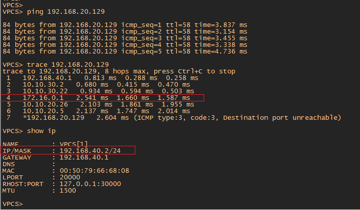

#  IPSec .

###  Задание:

IPSec over DmVPN
Цель: Настроить GRE поверх IPSec между офисами Москва и С.-Петербург
Настроить DMVPN поверх IPSec между офисами Москва и Чокурдах, Лабытнанги

1. Настроите GRE поверх IPSec между офисами Москва и С.-Петербург
2. Настроите DMVPN поверх IPSec между Москва и Чокурдах, Лабытнанги

- [Конфигурационные файлы;](config/)

### Для всех роутеров где будет настроен IPSeс будут применены одинаковые политики 1 и 2 фазы, чтоб не запутаться при просмотре работы. Отличием будут только пароли для создания 1 фазы. Для R15 Москва будет crypto isakmp key 12345. Для R14 Москва будет crypto isakmp key 123456. Хотя пароль может быть один для всех соединений. Это не принципиально. 

## 1. Настроите GRE поверх IPSec между офисами Москва и С.-Петербург

 1. На роутере R15 и R18 настроить первую и вторую фазы IPSec, настройка профиля IPSec

        1 Фаза
        crypto isakmp policy 1 - создает политики шифрования для 1 Фазы
        encr aes - устанавливает шифрование
        authentication pre-share - аутентификация по ключу
        group 14 - передеача хеша ключа по DH 2048 bit
        lifetime 3600 - изменение ключа каждый час
        crypto isakmp key 12345 address 200.200.30.18 - сам ключ 12345 с указанием адреса с которым будет утсановлен IPSec. В данном случае с R18
        
        2 Фаза
        crypto ipsec transform-set IPSec esp-aes esp-sha-hmac - режим для шифрования пользовательских данных с использованием протокола ESP
        mode transport - режим туннеля. В режиме transport не создается новый IP заголовок как в tunnel режиме. Экономится 20 байт
        
        настройка профиля IPSec
        crypto ipsec profile IPSec - создать профиль IPSec с именем IPSec
        set transform-set IPSec - привязать настройки 2 фазы к профилю. Название профиля совпадает по имени с название 2 фазы для удобства.
        
        Для привязки настроек к Tunnel 0 необходимо вместо crypto map использовать crypto ipsec profile
        
        На интерфейсе Tunnel 0 применить настройки IpSec 2 фазы
        int Tun 0
        tunnel protection ipsec profile IPsec
        
 2. На роутере R18 создать аналогичные настройки как на R15
        
        1 Фаза
        crypto isakmp policy 1 - создает политики шифрования для 1 фазы
        encr aes - устанавливает шифрование
        authentication pre-share - аутентификация по ключу
        group 14 - передеача хеша ключа по DH 2048 bit
        lifetime 3600 - изменение ключа каждый час
        crypto isakmp key 12345 address 100.100.20.15 -  отличительная команда указывающая на IP роутера R15 Москва
        
        2 Фаза
        crypto ipsec transform-set IPSec esp-aes esp-sha-hmac - режим для шифрования пользовательских данных с использованием протокола ESP
        mode transport - режим туннеля. В режиме transport не создается новый IP заголовок как в tunnel режиме. Экономится 20 байт
        
        настройка профиля IPSec
        crypto ipsec profile IPSec - создать профиль IPSec с именем IPSec 
        set transform-set IPSec - привязать настройки 2 фазы к профилю. Название профиля совпадает по имени с название 2 фазы для удобства.
        
        Для привязки настроек к Tunnel 0 необходимо вместо crypto map использовать crypto ipsec profile
        
        На интерфейсе Tunnel 0 применить настройки IpSec 2 фазы
        int Tun 0
        tunnel protection ipsec profile IPSec
        
 
  Из скриншота ниже видно, что установился туннель IPSec и инициатором является R15 Москва (был заранее выполнен пинг с R15 до R18).
  
  
  
  Пропингуем с ПК Питера имеющего адрес 192.168.40.2 адрес ПК Москвы 192.168.20.129 (адрес получаемый по DHCP из ДЗ по основным протоколам Интернет)
  
  
  
  Как видно из скриншота пинг удачно проходит и маршрут идет по туннелю 172.16.0.1 (цифра 4 в trace)
  
  
  
  Если роутер R15 Москва по каким-либо причинам будет не доступен, то VPN канал между R15 и R18 "развалится" и трафик пойдет по незашифрованному GRE туннелю между R14 и R18. 
Т.е. необходимо так же настроить  GRE over IPSec между R14 Москва и R18 Питер
  
  3. На роутере R14 настроить первую и вторую фазы IPSec, настройка профиля IPSec
  
         crypto isakmp policy 1
         encr aes 
         hash sha256
         authentication pre-share
         group 14 
         lifetime 3600

  4. На R18 добавить команду для создания мини-туннеля 1 фазы
  
         crypto isakmp key 123456 address 100.100.20.14 - ip адрес R14. Пароль 123456 - это пароль который был описан в самом начале ДЗ
  
  5. На роутере R18 настроить интерфейс Tunnel 1 (это второй туннель на этом роутере для GRE между R18 и R14).
  Настройки GRE over IPSec сводятся лишь к тому, что необходимо добавить в интерфей Tunnel 1 профиль IPSec  
         
         interface Tunnel1
         tunnel protection ipsec profile IPSec
         
         
    
   
   
   
