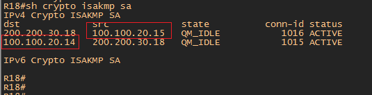
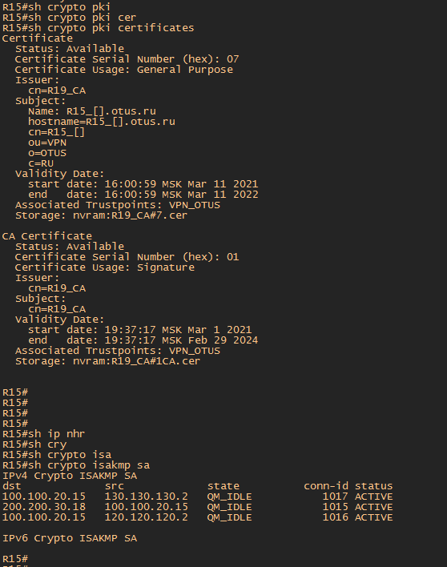
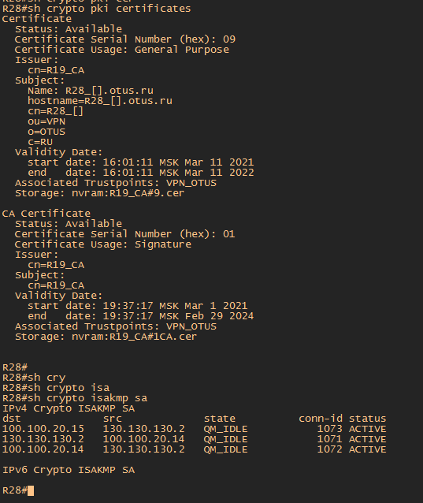

#  IPSec .

###  Задание:

IPSec over DmVPN
Цель: Настроить GRE поверх IPSec между офисами Москва и С.-Петербург
Настроить DMVPN поверх IPSec между офисами Москва и Чокурдах, Лабытнанги

1. Настроите GRE поверх IPSec между офисами Москва и С.-Петербург
2. Настроите DMVPN поверх IPSec между Москва и Чокурдах, Лабытнанги

- [Конфигурационные файлы;](config/)

### Из предыдущего задания настройка DMVPN выполнялась по технологии Dual Hub Single Cloud для реализации избыточности. В качестве Hub роутеров были настроены R14 и R15. Для всех роутеров где будет настроен IPSeс будут применены одинаковые политики 1 и 2 фазы, чтоб не запутаться при просмотре работы. Отличием будут только пароли для создания 1 фазы. Для R15 Москва будет crypto isakmp key 12345. Для R14 Москва будет crypto isakmp key 123456. Хотя пароль может быть один для всех соединений. Это не принципиально. 

## 1. Настроите GRE поверх IPSec между офисами Москва и С.-Петербург

 1. На роутере R15 и R18 настроить первую и вторую фазы IPSec, настройка профиля IPSec

        1 Фаза
        crypto isakmp policy 1 - создает политики шифрования для 1 Фазы
        encr aes - устанавливает шифрование
        authentication pre-share - аутентификация по ключу
        group 14 - передеача хеша ключа по DH 2048 bit
        lifetime 3600 - изменение ключа каждый час
        crypto isakmp key 12345 address 200.200.30.18 - сам ключ 12345 с указанием адреса с которым будет утсановлен IPSec. В данном случае с R18
        
        2 Фаза
        crypto ipsec transform-set IPSec esp-aes esp-sha-hmac - режим для шифрования пользовательских данных с использованием протокола ESP
        mode transport - режим туннеля. В режиме transport не создается новый IP заголовок как в tunnel режиме. Экономится 20 байт
        
        настройка профиля IPSec
        crypto ipsec profile IPSec - создать профиль IPSec с именем IPSec
        set transform-set IPSec - привязать настройки 2 фазы к профилю. Название профиля совпадает по имени с название 2 фазы для удобства.
        
        Для привязки настроек к Tunnel 0 необходимо вместо crypto map использовать crypto ipsec profile
        
        На интерфейсе Tunnel 0 применить настройки IpSec 2 фазы
        int Tun 0
        tunnel protection ipsec profile IPsec
        
 2. На роутере R18 создать аналогичные настройки как на R15
        
        1 Фаза
        crypto isakmp policy 1 - создает политики шифрования для 1 фазы
        encr aes - устанавливает шифрование
        authentication pre-share - аутентификация по ключу
        group 14 - передеача хеша ключа по DH 2048 bit
        lifetime 3600 - изменение ключа каждый час
        crypto isakmp key 12345 address 100.100.20.15 -  отличительная команда указывающая на IP роутера R15 Москва
        
        2 Фаза
        crypto ipsec transform-set IPSec esp-aes esp-sha-hmac - режим для шифрования пользовательских данных с использованием протокола ESP
        mode transport - режим туннеля. В режиме transport не создается новый IP заголовок как в tunnel режиме. Экономится 20 байт
        
        настройка профиля IPSec
        crypto ipsec profile IPSec - создать профиль IPSec с именем IPSec 
        set transform-set IPSec - привязать настройки 2 фазы к профилю. Название профиля совпадает по имени с название 2 фазы для удобства.
        
        Для привязки настроек к Tunnel 0 необходимо вместо crypto map использовать crypto ipsec profile
        
        На интерфейсе Tunnel 0 применить настройки IpSec 2 фазы
        int Tun 0
        tunnel protection ipsec profile IPSec
        
 
  Из скриншота ниже видно, что установился туннель IPSec и инициатором является R15 Москва (был заранее выполнен пинг с R15 до R18).
  
  
  
  Пропингуем с ПК Питера имеющего адрес 192.168.40.2 адрес ПК Москвы 192.168.20.129 (адрес получаемый по DHCP из ДЗ по основным протоколам Интернет)
  
  
  
  Как видно из скриншота пинг удачно проходит и маршрут идет по туннелю 172.16.0.1 (цифра 4 в trace)
  
  
  
  Если роутер R15 Москва по каким-либо причинам будет не доступен, то VPN канал между R15 и R18 "развалится" и трафик пойдет по незашифрованному GRE туннелю между R14 и R18. 
Т.е. необходимо так же настроить  GRE over IPSec между R14 Москва и R18 Питер
  
  3. На роутере R14 настроить первую и вторую фазы IPSec, настройка профиля IPSec
  
         crypto isakmp policy 1
         encr aes 
         hash sha256
         authentication pre-share
         group 14 
         lifetime 3600
         crypto isakmp key 123456 address 200.200.30.18
         
         2 Фаза
         crypto ipsec transform-set IPSec esp-aes esp-sha-hmac - режим для шифрования пользовательских данных с использованием протокола ESP
         mode transport - режим туннеля. В режиме transport не создается новый IP заголовок как в tunnel режиме. Экономится 20 байт
        
         настройка профиля IPSec
         crypto ipsec profile IPSec - создать профиль IPSec с именем IPSec
         set transform-set IPSec - привязать настройки 2 фазы к профилю. Название профиля совпадает по имени с название 2 фазы для удобства.
        
         Для привязки настроек к Tunnel 0 необходимо вместо crypto map использовать crypto ipsec profile
        
         На интерфейсе Tunnel 0 применить настройки IpSec 2 фазы
         int Tun 0
         tunnel protection ipsec profile IPsec

  4. На R18 добавить команду для создания мини-туннеля 1 фазы
  
         crypto isakmp key 123456 address 100.100.20.14 - ip адрес R14. Пароль 123456 - это пароль который был описан в самом начале ДЗ
         
    
  
  5. На роутере R18 настроить интерфейс Tunnel 1 (это второй туннель на этом роутере для GRE между R18 и R14).
  Настройки GRE over IPSec сводятся лишь к тому, что необходимо добавить в интерфей Tunnel 1 профиль IPSec  
         
         interface Tunnel1
         tunnel protection ipsec profile IPSec
         
         
    
   
   
   ## 2. Настроите DMVPN поверх IPSec между Москва и Чокурдах, Лабытнанги
   
   1. На роутерах R27 Лабытнаги и R28 Чокурдах настроить первую и вторую фазы IPSec, настройка профиля IPSec.
  
   На R15 и R14 Москва это было выполнено в 1 задании.
   Можно настроить другие политики 1 фазы и 2 фазы для Москвы и Чокурдах-Лабытнаги, но в данном ДЗ этого не имеет смысла.
   
        1 Фаза
        crypto isakmp policy 1 - создает политики шифрования для 1 фазы
        encr aes - устанавливает шифрование
        authentication pre-share - аутентификация по ключу
        group 14 - передеача хеша ключа по DH 2048 bit
        lifetime 3600 - изменение ключа каждый час
        crypto isakmp key 12345 address 100.100.20.15 - для установки мини-туннеля 1 фазы с R15 Москва
        crypto isakmp key 123456 address 100.100.20.14 - для установки мини-туннеля 1 фазы с R14 Москва
        
        2 Фаза
        crypto ipsec transform-set IPSec esp-aes esp-sha-hmac - режим для шифрования пользовательских данных с использованием протокола ESP
        mode transport - режим туннеля. В режиме transport не создается новый IP заголовок как в tunnel режиме. Экономится 20 байт
        
        настройка профиля IPSec
        crypto ipsec profile IPSec - создать профиль IPSec с именем IPSec 
        set transform-set IPSec - привязать настройки 2 фазы к профилю. Название профиля совпадает по имени с название 2 фазы для удобства.
  
   2. На R27 и R28 на туннельном интерфейсе Tunnel0 привязать профиль IPSec

          interface Tunnel0
          tunnel protection ipsec profile IPSec
          
   3. На роутерах R14 и R15 ввести команды для организации мини-туннеля 1 фазы

   На R14 
      
    crypto isakmp key 123456 address 120.120.120.2 - для Лабытнаги
    crypto isakmp key 123456 address 130.130.130.2 - для Чокурдах
    
   На R15 
      
    crypto isakmp key 12345 address 120.120.120.2 - для Лабытнаги
    crypto isakmp key 12345 address 130.130.130.2 - для Чокурдах 
    
   После введенных настроек на R27 и R28 создался туннель DMVPN защищенный IPSec 
   
    
   
    
   
   
  ## 3. * Для IPSec использовать CA и сертификаты
  
 1. Прежде всего на всех роутерах между которыми будет осуществляться IPSec шифрование с помошью сертификатов должно совпадать NTP время. Оно совпадает из предыдущего задания по настройке NTP
  
  
  
 2. Далее в качестве сервера CA будет использован роутер R19 c loopback адресом 19.19.19.19.
  Для настройки роутера R19 в качестве сервера CA необходимо выполнить:
  
        ip domain-name otus.ru - команда задает имя домена
        ip http server - включаем протокол http. Необходим для передачи закрытого ключа по протоколу SCEP
        crypto key generate rsa general-keys label R19_CA modulus 2048 - команда создает пару открытого и закрытого ключа для сервера CA с названием R19_CA
        
       
  
  
   Далее заходим в настройку сервера CA
       
       crypto pki server R19_CA
       database level complete - команда для ведения полной базы по выданным сертификатам
       no shutdown - включаем сервем CA
       no grant auto - запрещаем автоматическую выдачу запрашиваемых сертификатов. Будем выдавать вручную.
       
       crypto pki trustpoint R19_CA - trustpoint создаетcя автоматически, но так же trustpoint можно настроить дополнительно при выключенном сервере CA
       revocation-check none - команда для обращения к списку crl файла для отозванных сертификатов. В данном случае не обрашаться т.к. NONE!!!
       rsakeypair R19_CA - подключается пара ключей созданная ранее (label R19_CA)
       
   
   
   3. Далее настроить клиентские роутеры на работу с центром сертификации. На всех роутерах настройки будут идентичны.
   
          Москва - R14 и R15
          Питер - R18
          Чокурдах - R28
          Лабытнаги - R27
   
          ip domain-name otus.ru
          crypto key generate rsa label VPN modulus 2048
          
          crypto pki trustpoint VPN_OTUS
          enrollment url http://19.19.19.19
          fqdn RX.otus.ru - создать полное имя RX - где X номер маршрутизатора
          subject-name CN=RX,OU=VPN,O=OTUS,C=RU
          revocation-check none
          rsakeypair VPN - привязываем ключевую пару (label VPN)
          
          crypto pki authenticate VPN_OTUS - получение сертификата от центра сертификации R19 т.к. выше указана команда enrollment url http://19.19.19.19
          crypto pki enroll VPN_OTUS - запрос собственного сертификата от центра сертификации
          
       После введенных настроек на роутерах, необходимо на сервере сертификации R19  разрешить выдачу запрашиваемых сертифкатов. 
       Сертификат под номером 5 не включен в список выдаваемых. (Запрошен по ошибке)
       
   
     
   После одобрения получения сертификатов, на маршрутизаторах появляется следующее сообщения говорящие о получении сертифката от CA.
     
     
   
   4. На роутерах в настройках 1 фазы IPSec необходимо отменить аутентификацию по pre-share ключу и настроить по rsa-sig сертификатам.
   
          crypto isakmp policy 1
          no authentication pre-share 
          authentication rsa-sig
          
   Результатом выполнения данных команд будет установка "коннекта" между офисами по сертификатам. В качестве примера на скриншотах роутер R15 и R28 c двумя сертифкатами и установкой IPSec 1 фазы.     

     
   
     

