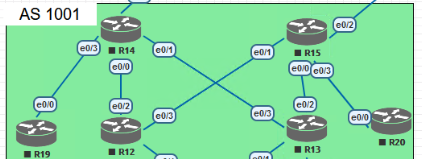
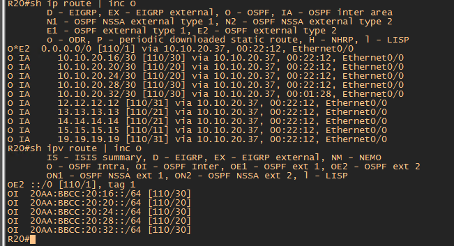

#  OSPF

###  Задание:

Цель: Настроить OSPF офисе Москва
Разделить сеть на зоны
Настроить фильтрацию между зонами
1. Маршрутизаторы R14-R15 находятся в зоне 0 - backbone
2. Маршрутизаторы R12-R13 находятся в зоне 10. Дополнительно к маршрутам должны получать маршрут по-умолчанию
3. Маршрутизатор R19 находится в зоне 101 и получает только маршрут по умолчанию
4. Маршрутизатор R20 находится в зоне 102 и получает все маршруты, кроме маршрутов до сетей зоны 101
5. Настройка для IPv6 повторяет логику IPv4

- [Конфигурационные файлы](config/)

### Изначальная схема сети

В изначальной топологии есть недостаток.

Согласно задания маршрутизаторы R14 и R15 должны находится в Area0. Но при такой топологии существует разрыв между Area0, что противоречит правильному построению топологии OSPF.

### Необходимо изменить схему следующим образом:

При данной топологии появляется свзяь между R14 и R15 по Area0.
Если упадет канал между R14 и R15, то трафик пойдет по Virtual-Link между R12 и R13 (настройки будут приведены далее).

Так же необходимо изменить адресацию сети из-за смены линков

| Equip | Port | AddrTyp | Address                  | Network                | Description     |
|-------|------|---------|--------------------------|------------------------|-----------------|
|	R14	|	e0/0	|	IPv4		|	10.10.20.18	|	10.10.20.16/30	|	to	R12	e0/2	|
|	R14	|	e0/0	|	IPv6		|	20AA:BBCC:20:16::18/64	|	20AA:BBCC:20:16::/64	|	to	R12	e0/2	|
|	R14	|	e0/0	|	IPv6	LL	|	FE80::14	|	FE80::/10	|	to	R12	e0/2	|
|	R14	|	e0/1	|	IPv4		|	10.10.20.21	|	10.10.20.20/30	|	to	R115	e0/1	|
|	R14	|	e0/1	|	IPv6		|	20AA:BBCC:20:20::21/64	|	20AA:BBCC:20:20::/64	|	to	R15	e0/1	|
|	R14	|	e0/1	|	IPv6	LL	|	FE80::14	|	FE80::/10	|	to	R15	e0/1	|
|	R14	|	e0/3	|	IPv4		|	10.10.20.33	|	10.10.20.32/30	|	to	R19	e0/0	|
|	R14	|	e0/3	|	IPv6		|	20AA:BBCC:20:32::33/64	|	20AA:BBCC:20:32::/64	|	to	R19	e0/0	|
|	R14	|	e0/3	|	IPv6	LL	|	FE80::14	|	FE80::/10	|	to	R19	e0/0	|
|	R15	|	e0/1	|	IPv4		|	10.10.20.22	|	10.10.20.20/30	|	to	R14	e0/1	|
|	R15	|	e0/1	|	IPv6		|	20AA:BBCC:20:20::22/64	|	20AA:BBCC:20:20::/64	|	to	R14	e0/1	|
|	R15	|	e0/1	|	IPv6	LL	|	FE80::15	|	FE80::/10	|	to	R14	e0/1	|
|	R15	|	e0/0	|	IPv4		|	10.10.20.25	|	10.10.20.24/30	|	to	R13	e0/2	|
|	R15	|	e0/0	|	IPv6		|	20AA:BBCC:20:24::25/64	|	20AA:BBCC:20:24::/64	|	to	R13	e0/2	|
|	R15	|	e0/0	|	IPv6	LL	|	FE80::15	|	FE80::/10	|	to	R13	e0/2	|
|	R15	|	e0/3	|	IPv4		|	10.10.20.37	|	10.10.20.36/30	|	to	R20	e0/0	|
|	R15	|	e0/3	|	IPv6		|	20AA:BBCC:20:36::37/64	|	20AA:BBCC:20:36::/64	|	to	R20	e0/0	|
|	R15	|	e0/3	|	IPv6	LL	|	FE80::15	|	FE80::/10	|	to	R20	e0/0	|
|	R12	|	e0/2	|	IPv4		|	10.10.20.17	|	10.10.20.16/30	|	to	R14	e0/0	|
|	R12	|	e0/2	|	IPv6		|	20AA:BBCC:20:16::17/64	|	20AA:BBCC:20:16::/64	|	to	R14	e0/0	|
|	R12	|	e0/2	|	IPv6	LL	|	FE80::12	|	FE80::/10	|	to	R14	e0/0	|
|	R12	|	e0/3	|	IPv4		|	10.10.20.30	|	10.10.20.28/30	|	to	R13	e0/3	|
|	R12	|	e0/3	|	IPv6		|	20AA:BBCC:20:28::30/64	|	20AA:BBCC:20:28::/64	|	to	R13	e0/3	|
|	R12	|	e0/3	|	IPv6	LL	|	FE80::12	|	FE80::/10	|	to	R13	e0/3	|
|	R13	|	e0/2	|	IPv4		|	10.10.20.26	|	10.10.20.24/30	|	to	R15	e0/0	|
|	R13	|	e0/2	|	IPv6		|	20AA:BBCC:20:24::26/64	|	20AA:BBCC:20:24::/64	|	to	R15	e0/0	|
|	R13	|	e0/2	|	IPv6	LL	|	FE80::13	|	FE80::/10	|	to	R15	e0/0	|
|	R13	|	e0/3	|	IPv4		|	10.10.20.29	|	10.10.20.28/30	|	to	R12	e0/3	|
|	R13	|	e0/3	|	IPv6		|	20AA:BBCC:20:28::29/64	|	20AA:BBCC:20:28::/64	|	to	R15	e0/0	|
|	R13	|	e0/3	|	IPv6	LL	|	FE80::13	|	FE80::/10	|	to	R15	e0/0	|
|	R19	|	e0/0	|	IPv4		|	10.10.20.34	|	10.10.20.32/30	|	to	R14	e0/3	|
|	R19	|	e0/0	|	IPv6		|	20AA:BBCC:20:32::34/64	|	20AA:BBCC:20:32::/64	|	to	R14	e0/3	|
|	R19	|	e0/0	|	IPv6	LL	|	FE80::19	|	FE80::/10	|	to	R14	e0/3	|
|	R20	|	e0/0	|	IPv4		|	10.10.20.38	|	10.10.20.36/30	|	to	R15	e0/3	|
|	R20	|	e0/0	|	IPv6		|	20AA:BBCC:20:36::38/64	|	20AA:BBCC:20:36::/64	|	to	R15	e0/3	|
|	R20	|	e0/0	|	IPv6	LL	|	FE80::20	|	FE80::/10	|	to	R15	e0/3	|

### Конфигурация маршрутизаторов сводиться к следующим настройкам:

1. Включаем на роутере процес OSPF для IPv4 и IPv6
          
       RX(config)#router ospf 1
       RX(config)#ipv6 router ospf 1
       
2. Интерфейсы роутеров добавляем к процесу OSPF IPv4 и IPv6 указывая номер AREA
 
       RX(config-if)#ip ospf 1 area X
       RX(config-if)#ipv6 ospf 1 area X
 
3. По скольку в данной топологии все роутреы соеденены между собой точка-точка, то нет необходимости в выбое DR и BDR. Так же с помошью команды приведенной ниже прекратится рассылка LSA2, что снизит объяем служебного трафика.
      
       RX(config-if)#ip ospf network point-to-point
       RX(config-if)#ipv6 ospf network point-to-point
       
 4. В случае отключения линка между R14 и R15 произойдет разрыв между Area0. Для этого нужно создать Virtual-Link между R12 и R13 для резервного маршрута. 
 
        R12(config-router)#area 10 virtual-link 13.13.13.13
        R13(config-router)#area 10 virtual-link 12.12.12.12
        
  
 На скриншоте видно, что если линк между R14 и R15 в рабочем сотсоянии то трафик от R19 идет через R14-R15-R20
 
 
 
 Создадим обрыв линка между R14 и R15. Как видно из скриншота, трафик от R19 пошел через R14-R12-R13-R15-R20
 
 
       
      

Согласно задания необходимо анонсировать маршрут по умолчанию. Данную процедуру необходимо выполнить на маршрутизаторах смотрящих на провайдера т.е R14 и R15.

Для IPv4

      R14(config-router)#default-information originate always 
      R15(config-router)#default-information originate always 

Для IPv6

      R14(config-rtr)#default-information originate always
      R15(config-rtr)#default-information originate always
      
### 3. Маршрутизатор R19 находится в зоне 101 и получает только маршрут по умолчанию.
           
     R19(config-if)#ip ospf 1 area 101
     R19(config-if)#ipv6 ospf 1 area 101
     
 До выполнения задания "R19 получает только маршрут по умолчанию" таблица маршрутизации R19 выглядит следующим образом.
 
 
 
 Для выполнения данного задания необходимо на ABR R14 маршрутизаторе выполнить команду:
 
 Для IPv4 и IPv6
 
     R14(config-router)#are 101 stub no-summary      
     R14(config-rtr)#area 101 stub no-summary
 
 На Stub маршрутизаторе R19:
 
      R19(config-router)#area 101 stub
      R19(config-rtr)#area 101 stub
      
 После введенных настроек таблица маршрутизации на R19 выглядит: 
 
 
 
 
### 4. Маршрутизатор R20 находится в зоне 102 и получает все маршруты, кроме маршрутов до сетей зоны 101.
      
      R20(config-if)#ip ospf 1 area 102
      R20(config-if)#ipv6 ospf 1 area 102
      
 Далее необходимо выполнить фильтрацию маршрутов так, что бы R20 не получал маршрут из зоны 101. Т.е. не получал маршрут IPv4 10.10.20.32 /30 и IPv6 (20AA:BBCC:20:32::/64) 
 
 Ниже представлена таблица маршрутизации R20 до фильтрации.
 
 
 
 На ABR роутере R15 необходимо создать prefix-list для IPv4 и IPv6
 
    R15(config)#ip prefix-list NO_AREA101 seq 5 deny 10.10.20.32/30
    R15(config)#ip prefix-list NO_AREA101 seq 10 permit 0.0.0.0/0 le 32
    
    R15(config)#ipv6 prefix-list NO_AREA101 deny 20AA:BBCC:20:32::/64 - для IPv6
    
 Далее в конфигурации протокола OSPF указать название prefix-list и действие prefix-list
 
    R15(config-router)#area 102 filter-list prefix NO_AREA101 in - для IPv4
    R15(config-rtr)#distribute-list prefix-list NO_AREA101 in - для IPv6
    
 После ввода команд таблица маршрутизации на R20 выглядит следующим образом:
 
 
 
 Как видно из скриншота, маршруты IPv4 (10.10.20.32/30) и IPv6 (20AA:BBCC:20:32::/64) из зоны 101 пропали 
     
