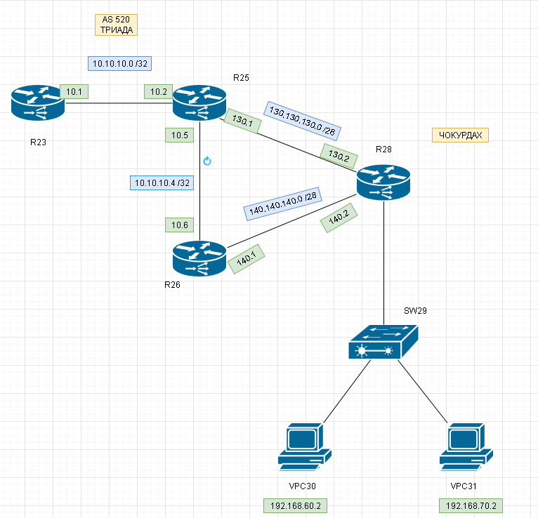

# Маршрутизация. Policy-based routing & IP SLA.

###  Задание:

####  Цель: Настроить политику маршрутизации в офисе Чокурдах
 
Распределить трафик между 2 линками

1. Настроите политику маршрутизации для сетей офиса
2. Распределите трафик между двумя линками с провайдером
3. Настроите отслеживание линка через технологию IP SLA
4. Настройте для офиса Лабытнанги маршрут по-умолчанию
5. План работы и изменения зафиксированы в документации 

###  Решение:
1.Настроите политику маршрутизации для сетей офиса 

В качетсве решения данной задачи была выбрана динамическая маршрутизация (OSPF) между роутерами R23, R25, R26, R28.
Настройка протокола OSPF производилась на интерфейсах маршрутизаторов.
Пример конфига для всех интерфейсов

    interface EthernetX/Z
    ip address x.x.x.x z.z.z.z
    ip ospf network point-to-point
    ip ospf 1 area 0
   
Данные команды применены для всех интерфейсов где включен OSPF 

* Роутер R23 - интерфейс e0/1
* Роутер R25 - интерфейсы e0/0, e0/2, e0/3
* Роутер R26 - интерфейсы e0/2, e0/1
* Роутер R28 - интерфейсы e0/0, e0/1, e0/2.60, e0/2.70

| Network IPv4     |  Eq&port       |
|-----------------:|:---------------|
| 10.10.10.0/30    | R23e0/1 R25e0/1|
