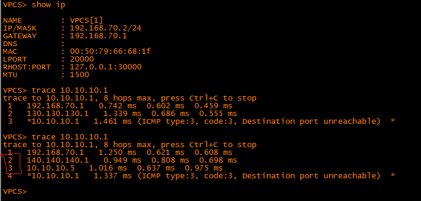

# Маршрутизация. Policy-based routing & IP SLA.

###  Задание:

####  Цель: Настроить политику маршрутизации в офисе Чокурдах
 
Распределить трафик между 2 линками

1. Настроите политику маршрутизации для сетей офиса
2. Распределите трафик между двумя линками с провайдером
3. Настроите отслеживание линка через технологию IP SLA
4. Настройте для офиса Лабытнанги маршрут по-умолчанию
5. План работы и изменения зафиксированы в документации 

###  Решение:
### 1.Настроите политику маршрутизации для сетей офиса 

В качетсве решения данной задачи была выбрана динамическая маршрутизация (OSPF) между роутерами R23, R25, R26, R28.
Настройка протокола OSPF производилась на интерфейсах маршрутизаторов.
Пример конфига для всех интерфейсов

    interface EthernetX/Z
    ip address x.x.x.x z.z.z.z
    ip ospf network point-to-point
    ip ospf 1 area 0
   
Данные команды применены для всех интерфейсов где включен OSPF 

* Роутер R23 - интерфейс e0/1
* Роутер R25 - интерфейсы e0/0, e0/2, e0/3
* Роутер R26 - интерфейсы e0/2, e0/1
* Роутер R28 - интерфейсы e0/0, e0/1, e0/2.60, e0/2.70

| Network IPv4     |  Eq&port       |
|-----------------:|:---------------|
| 10.10.10.0/30    | R23e0/1 R25e0/0|   
| 10.10.10.4/30    | R25e0/2 R26e0/2|             
| 130.130.130.0/28 | R25e0/3 R28e0/1|
| 140.140.140.0/28 | R26e0/1 R28e0/0|
| 192.168.60.0/24  |   R28e0/2.60   |
| 192.168.70.0/24  |   R28e0/2.70   |

### 2.Распределите трафик между двумя линками с провайдером

После прощета топологии OSPF, кратчайщий путь от R23 (e0/1 ip 10.10.10.1) до компьютеров VPC30 и VPC31 проходит через роутер R25 обходя роутер R26.

Необходимо трафик от VPC31 (ip 192.168.70.2) направить через роутер R26 (e0/1 ip 140.140.140.1).
1. создать ACL и указать какую сеть необходимо отслеживать

       R28(config)#ip access-list extended PC
       R28(config-ext-nacl)#permit 192.168.70.0 0.0.0.255 any
       
2. Создать Route-map с именем PC, указать соответсвие того, что будем проверять и действие после соответсвия. 
       
       R28(config)#route-map PC
       R28(config-route-map)#match ip address PC
       R28(config-route-map)#set ip next-hop 140.140.140.1
       
3. "Вешаем" созданный route-map  на саб-интерфейс e0/2.70 маршрутизатора R28 

       R28(config)#int e0/2.70
       R28(config-subif)#ip policy route-map PC
 
 Результат после применения route-map

Как видно из скриншота маршрут от VPC30 остался без изменений, а маршрут от VPC31 пошел через роутер R26 (e0/1 ip 140.140.140.1)

### 3. Настроите отслеживание линка через технологию IP SLA

Что необходимо выполнить:
1. Создать IP SLA
2. Задать параметр т.е. SLA будет пинговать шлюз маршрута по умолчанию с адреса источника
3. Задать частоту пинга
4. Задать постоянный пинг и запустить задачу прямо сейчас

       R28(config)#ip sla 1
       R28(config-ip-sla)#icmp-echo 130.130.130.1 source-ip 130.130.130.2
       R28(config-ip-sla)#frequency 5
       R28(config)#ip sla schedule 1 life forever start-time now
       
  Далее необходимо настроить track  отслеживания, который будет проверять действие ip sla. Т.е. если удаленный хост доступен, то маршрут по умолчанию будет находится в таблице маршрутизации. Если удаленный хост не доступен, то маршрут удаляется из таблицы маршрутизации.
   
     R28(config)#track 1 ip sla 1 reachability
  
 Создать маршрут по умолчанию с треком отслеживания 
 
    R28(config)#ip route 0.0.0.0 0.0.0.0 130.130.130.1 track 1
    
  Как выглядят настройки маршрутизатора с доступным маршрутом по умолчанию:
В конфиге находятся два маршрута:
   
    ip route 0.0.0.0 0.0.0.0 130.130.130.1 track 1
    ip route 0.0.0.0 0.0.0.0 140.140.140.1 20

Таблица маршрутизации R28 выглядит следующим образом:

Создаем ситуацию когда шлюз по умолчанию (IP 130.130.130.1) становится недоступным.
Срабатывает Track отслеживания

И таблица маршрутизации после изменнеия выглядит следующим образом:

        
