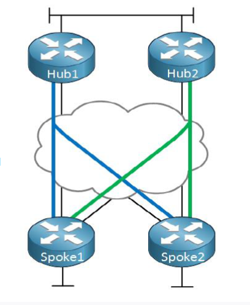
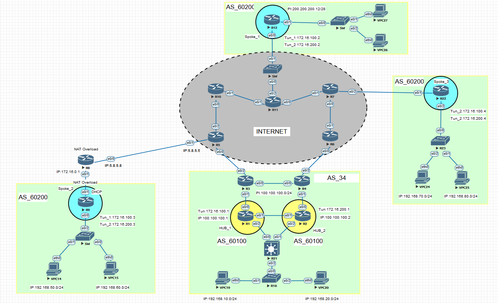
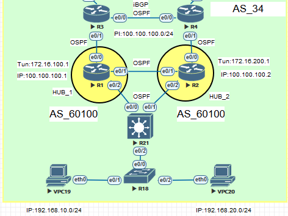
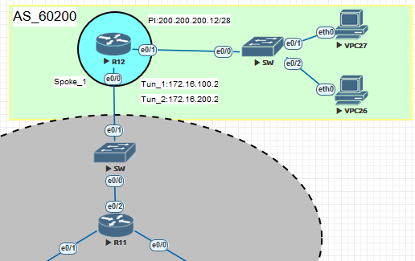
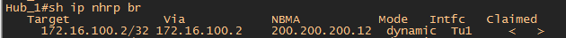
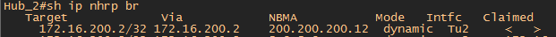

#  Тема: Внедрение динамической маршрутизации через безопасные VPN каналы с технологией DMVPN over IPSec

##  Цели проекта:

#### Организовать соединение удаленных офисов с помощью site-to-site VPN (DMVPN)

#### Настроить протокол динамической маршрутизации BGP внутри DVMPN

#### Обеспечить защиту передаваемых данных между удаленными офисами с помощью протоколов IPSec

- [Конфигурационные файлы;](config/)

## Используемые технологии

#### Для организации связи между удаленными офисами использовался DMVPN Phase 3

#### Для организации связи между удаленными офисами использовался протокол BGP

#### Шифрование осуществлялось с помощью протоколов группы IPSec

#### Схема DMVPN Dual HUB Dual CLOUD

## Коротко о технологии Dynamic Miltipoint VPN

### Технология DMVPN состоит из следующих протоколов:

**Multipoint GRE** (mGRE)

Протокол **NHRP** (Next Hop Resolution Protocol)

Протоколы **IPSec** * настраивается опционально

Статическая маршрутизация/Динамическая маршрутизация (кроме протокола IS-IS)

**HUB** маршрутизатор он же NHS сервер главный маршрутизатор к которому подключаются Spoke

**SPOKE** маршрутизатор он же NHC клиент подключается и регистрируется на HUB маршрутизаторе

**Технология DMVPN для организации VPN каналов была выбрана из-за простоты настройки т.к. на Hub маршрутизаторе создается только один туннельный интерфейс для соединения co Spoke маршрутизаторами.
Hub маршрутизатор настраивается один раз.
Минимальные однообразные настройки на всех Spoke маршрутизаторах**

**Приемущества 3 фазы DMVPN состоит в том, что передача трафика происходит между Spoke маршрутизаторами без участия Hub (на Hub отправляется только первый пакет с использованием CEF).
Так же возможна суммаризация маршрутов на Hub маршрутизаторе (кроме OSPF)**

**Протокол BGP был выбран т.к. он очень хорошо подходит для маштабируемости DMVPN сети. Для BGP 1000-2000 Spoke не проблема. Так же протокл BGP позволяет гибко управлять маршрутами и выполнять суммаризайию маленьких подсетей за Spoke маршрутизаторами на Hub маршрутизаторе. Это надежный протокол для ненадежных VPN каналов т.к. устанавливается TCP сессия.**

Схема построения сети DMVPN была выбрана **Dual Hub Dual Cloud** т.к. она хорошо подходит для организации избыточности. Увеличивается колличетво точек отказа.
На Hub маршрутезаторе "поднимается" 1 туннельный интерфейс, на Spoke 2 туннельных интерфейса "смотрящих" на каждый Hub. 

Ниже представлена общая схема сети

На схеме область **INTERNET** это область где все маршрутизаторы связаны между собой по BGP (имитация Интерент). Номер маршрутизатора - это номер AS.
Пример: маршрутизатор R6 - номер AS_6

IP адресация настроена следующим образом: 

Пример R4 соединен c R6 по номерам маршрутизаторов от меньшей цифры к большей т.е. R4 имеет адрес 4.6.4.4 /24 где последний октет это номер маршрутизатора R4, аналогично маршрутизатор R6 имеет адрес 4.6.4.6 /24 где последний октет это номер маршрутизатора R6

Маршрутизаторы R5 и R6 отдают по BGP дефолтный маршрут, в сторону центрального офиса AS_34 к маршрутизаторам R3 и R4 соответсвенно.

AS_34 имеет свой pool PI адресов 100.100.100.0/24. 

Маршрутизатор R4 иммет приоритет выхода в Интернет с помошью заданного Local Preference. Для этого на маршрутизаторе R4 была создана route-map

    route-map TO_AS_6 permit 10
    set local-preference 150
    
Далее в настройках BGP на R4 "вешаем" созданную route-map

    neighbor 4.6.4.6 route-map TO_AS_6 in

Так же с помошью prefix-list маршрутизаторы R3 и R4 анонсируют в Интернет только префикс с 24-ой маской т.е. 100.100.100.0 /24

    ip prefix-list AS60100 seq 5 permit 100.100.100.0/24
    
C помошью route-map "матчим" адреса из prefix-list

     route-map AS60100 permit 10
     match ip address prefix-list AS60100
     
"Вешаем на соседей R5 и R6 созданный route-map
 
      neighbor 3.5.3.5 route-map AS60100 out - в сторону R5 AS_5
      neighbor 4.6.4.6 route-map AS65100 out - в сторону R6 AS_6
    
В AS_34 маршрутизация настроена следующим образом:    

На маршрутизаторах R3, R4, R1 и R2 "подняты" loopback 1 с PI адресами. 

Пример:

    маршрутизатор R4 - 100.100.100.4
    маршрутизатор R3 - 100.100.100.3
    маршрутизатор R1 - 100.100.100.1
    маршрутизатор R2 - 100.100.100.2
    

Между R3 и R4 установлено iBGP соседство. 

Так же между всеми маршрутизаторами в AS_34 установлено OSPF соседство. Т.е. на R1 и R2, которые будут использованы в качетсве Hub, интерфейсы loopback 1 (100.100.100.1 и 100.100.100.2) добавлены в процесс OSPF.
     
     R1
     interface Loopback1
     ip address 100.100.100.1 255.255.255.255
     ip ospf 1 area 0
     
     R2
     interface Loopback1
     ip address 100.100.100.2 255.255.255.255
     ip ospf 1 area 0
     
 Для чего это было сделано.....? По скольку R3 и R4 анонсируют префикс PI 100.100.100.0 /24 в Интернет, то ВСЕ маршрутизаторы будут знать как добраться до этой сети. И если ответ из Интернета придет на R3 или R4 c DST 100.100.100.1-2, то R3 или R4 будут знать куда направить пакет т.к. между R1-R2-R3-R4 есть OSPF соседство.  Т.е. благодаря OSPF внутри AS_34 маршрутизаторы R1 - Hub1 и R2 - Hub2, будут иметь ip связанность с Интернет.
 
R1 и R2 были выбраны в качестве Hub маршрутизаторов по причине того, что внутри DMVPN будет использоваться протокл BGP c серыми AS. По скольку маршрутизаторы R3 и R4 "дружат" по eBGP с маршрутизаторами в Интернете, то на них уже поднят процес BGP c белой AS_34. Второй процес BGP на них поднять нельзя.

После настройки IP связанности переходим к настройке DMVPN на Hub маршрутизаторах R1 И R2.

    IP адрессация туннелей для R1 Hub_1 - 172.16.100.0 /24

    IP адрессация туннелей для R2 Hub_2 - 172.16.200.0 /24

Для R1 Hub_1

   
    interface Tunnel1 - создаем виртуальный туннельный интерфейс Tunnel1
    ip address 172.16.100.1 255.255.255.0 - назначаем ip адрес на интерфейс
    ip mtu 1400 - выставляем MTU согласно рекомендаций Cisco т.к. в дальнейшем будет добавлен IPSec заголовок
    ip nhrp map multicast dynamic - автоматическое добавление Spoke адресов в таблицу NHRP
    ip nhrp network-id 100 - локальный идентификатор (на другом конце может отличаться) необходим для разграничения туннелей на маршрутизаторе 
    ip nhrp redirect - ключевая команда для работы DMVPN в 3 фазе
    ip tcp adjust-mss 1360 - уменьшает значение TCP MSS в TCP SYN Packet
    tunnel source Loopback1 - из под loopback1 с PI адресом 100.100.100.1 будет строиться туннель
    tunnel mode gre multipoint - команда для работы в режиме mGRE
    tunnel path-mtu-discovery - позволяет установить на GRE интерфейсе оптимальное значение MTU
    
    
Для R2 Hub_2 создаем аналогичный туннель с небольшими изменениями 

     
     interface Tunnel1
     ip address 172.16.200.1 255.255.255.0 - создаем адрес для Hub_2 из подсети отличной от Hub_1
     ip nhrp network-id 200 - можно выставить любой ID т.к. он локальный, но в дальнейшем на Spoke будет создано 2 туннеля. Удобней траблшутить
     tunnel source Loopback1 - из под loopback1 с PI адресом 100.100.100.2 будет строиться туннель
     ip mtu 1400
     ip nhrp map multicast dynamic
     ip nhrp redirect
     ip tcp adjust-mss 1360
     tunnel mode gre multipoint
     tunnel path-mtu-discovery
     
 
 На Spoke маршрутизаторах необходимо создать по два интерфейса Tunnel для связи с Hub_1 и Hub_2   
    
 
 
 На схеме выше удаленный офис R12 получает pool PI адресов от провайдера R11 AS_11 не по BGP. Провайдер R11 выделил подсеть 200.200.200.0 /28 и отдал эту подсеть в VLAN на R12 через коммутатор. Соответсвенно теперь R12 может строить туннели из под белых адресов из диапозона 200.200.200.0 /28.
 На интерфейсе e0/0 R12 настроим IP 200.200.200.12
 
 Создаем туннели
 
    interface Tunnel1
    ip address 172.16.100.2 255.255.255.0
    ip mtu 1400
    ip nhrp map 172.16.100.1 100.100.100.1 - создает в NHRP статическое соответствие между адресом тунеля и белым адресом Hub_1
    ip nhrp network-id 100
    ip nhrp nhs 172.16.100.1 - указываем адрес туннельного интерфейса как next-hop сервера
    ip nhrp shortcut - ключевая настройка для работы Spoke в режиме 3 фазы DMVPN
    ip tcp adjust-mss 1360
    tunnel source Ethernet0/0 - из под данного интерфейса строится туннель. IP 200.200.200.12 /28
    tunnel mode gre multipoint
    tunnel path-mtu-discovery
    
    
    interface Tunnel2
    ip address 172.16.200.2 255.255.255.0
    no ip redirects
    ip mtu 1400
    ip nhrp map 172.16.200.1 100.100.100.2
    ip nhrp network-id 200
    ip nhrp nhs 172.16.200.1
    ip nhrp registration timeout 30
    ip nhrp shortcut
    ip tcp adjust-mss 1360
    tunnel source Ethernet0/0
    tunnel mode gre multipoint
    tunnel path-mtu-discovery
    
 После выполнения данных настроек на Hub_1 и Hub_2 появились динамические записи в таблице NHRP 
 
 
 
 
    
 
Далее настроим динамическую маршрутизацию с помошью протокола BGP для того, что бы можно было добраться до офисных сетей.

По скольку будет использоваться протокол BGP, то предполагается, что соседей Spoke будет более 100-200 и устанавливать соседство по BGP с каждым Spoke будет неудобно.
Для этого создадим на Hub_1 процес BGP 60100

    router bgp 60100
    neighbor DMVPN_100 peer-group - создается группа соседей с именем DMVPN_100
    bgp listen range 172.16.100.0/24 peer-group DMVPN_100 - создается pool адресов для этой группы. Т.е. Hub будет устанавливать соседство со Spoke из диапозона 172.16.100.0 /24
    bgp listen limit 250 - количество возможных соседей BGP 
    aggregate-address 192.168.0.0 255.255.0.0 summary-only - выполняет суммаризацию офисных подсетей
    neighbor DMVPN_100 remote-as 60200 - устанавливает BGP соседство с Spoke находящихся в AS_60200
    neighbor DMVPN_100 next-hop-self - команда для изменения nex-hop Spoke на next-hop Hub. Необходима для правильной работы 3 фазы DMVPN
    
Аналогичные команды задаим на Hub_2

    router bgp 60100
    bgp listen range 172.16.200.0/24 peer-group DMVPN_200
    bgp listen limit 250
    aggregate-address 192.168.0.0 255.255.0.0 summary-only
    neighbor DMVPN_200 peer-group
    neighbor DMVPN_200 remote-as 60200
    neighbor DMVPN_200 next-hop-self
