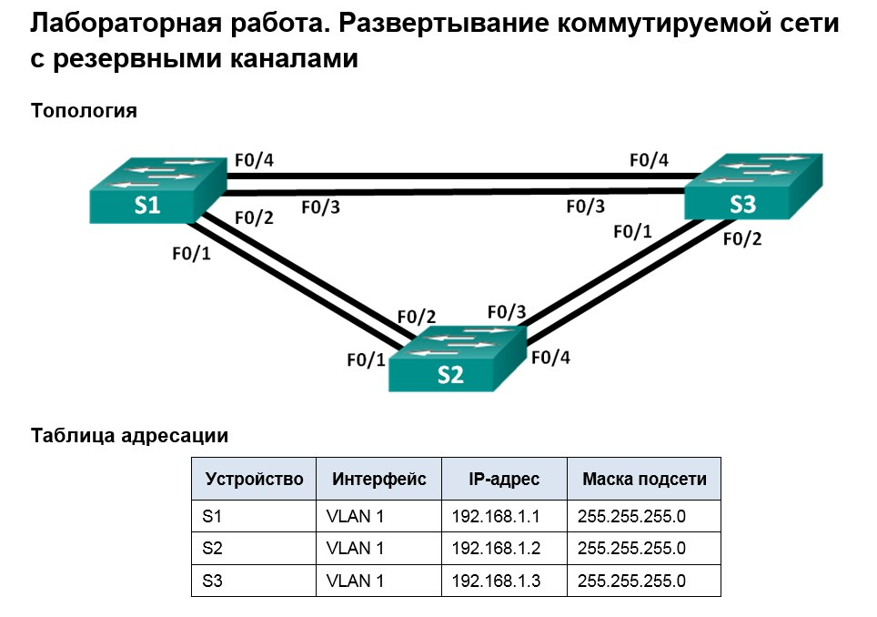
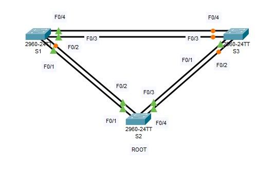
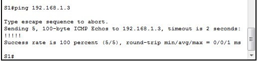
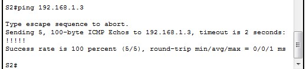
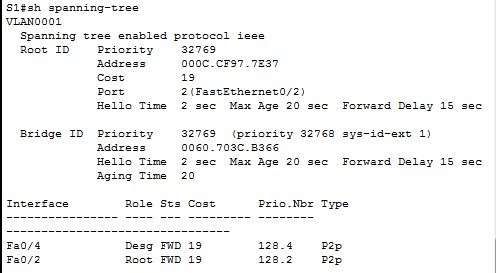
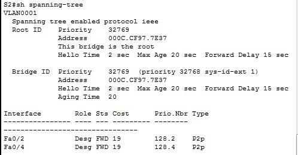
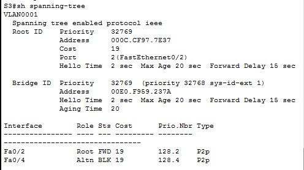
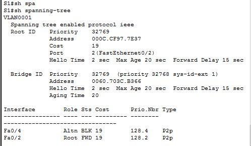
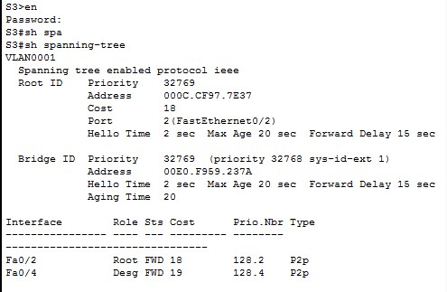

#  Настройка STP
###  Схема топологии настраевоемой сети:

##	Цели
* Часть 1. Создание сети и настройка основных параметров устройства
* Часть 2. Выбор корневого моста
* Часть 3. Наблюдение за процессом выбора протоколом STP порта, исходя из стоимости портов
* Часть 4. Наблюдение за процессом выбора протоколом STP порта, исходя из приоритета портов

# Часть 1

## Шаг 1 и Шаг 2 отображены на схеме

## Шаг 3
    Конфигурация устройств согласно методичке:
- [Конфигурационные файлы;](config/)

## Шаг 4
    Проверить связь между:
    от коммутатора S1 на коммутатор S2

    от коммутатора S1 на коммутатор S3

    от коммутатора S2 на коммутатор S3

# Часть 2
## Шаг 1. Отключите все порыт на коммутаторах.  
    (config)#interface range fa0/1-24
    (config)#shutdown
    (config)#interface range gi0/1-2
    (config)#shutdown
    
    Данные команды вводятся аналогично на трех коммутаторах согласно схемы.

## Шаг 2. Настройте подключенные порты в качестве транковых.
    (config)#interface range fa0/1-4
    (config)#switchport mode trunk
    
    Данная команды вводится аналогично на трех коммутаторах согласно схемы.
    
 ## Шаг 3. Включите порты F0/2 и F0/4 на всех коммутаторах.
    (config)#interface range fa0/2 , fa0/4
    (config)#no shutdown
    
    Данные команды вводятся аналогично на трех коммутаторах согласно схемы.

## Шаг 4. Отобразите данные протокола spanning-tree.

## Ответы на вопросы по Части 2
Какой коммутатор является корневым мостом? 

    Корневым коммутатором стал S2
Почему этот коммутатор был выбран протоколом spanning-tree в качестве корневого моста?

    При обмене BPDU между коммутаторами, Bridge ID коммутатора S2 оказался меньше по сравнению с другими.
Какие порты на коммутаторе являются корневыми портами? 

    S2 - нет корневых портов т.к. он Root. 
    S1 – порт fa0/1
    S3 – порт fa0/2
Какие порты на коммутаторе являются назначенными портами? 

    S2 - порт fa0/2 и порт fa0/4
    S1 – порт fa0/4
    S3 – нет назначенных портов
Какой порт отображается в качестве альтернативного и в настоящее время заблокирован?

    S3 – порт fa0/4
Почему протокол spanning-tree выбрал этот порт в качестве невыделенного (заблокированного) порта?

    После выбора Root коммутатора (в данном примере S2), коммутаторы S1 и S3 начинают сравнивать расстояние до Root S2 (Root Path Cost). Оно у обоих коммутаторов одинаковое. Далее коммутаторы S1 и S3 начинают сравнивать свои Bridge ID. Выбирается тот, у кого Bridge ID меньше (S1).  Соответственно S3 блокирует один из своих портов. В данном случае порт fa0/4. 

# Часть 3
## Шаг 2. 
Согласно инструкции с помощью команды понижаем приоритет порта.

    S3(config)# interface f0/2
    S3(config-if)# spanning-tree vlan 1 cost 18
Теперь порт fa0/4 на коммутаторе S3 становится назначенным, а порт коммутатора S1 fa0/4 который был назначенным, стал заблокированным

## Шаг 3.

### Вопрос к Шаг 3
Почему протокол spanning-tree заменяет ранее заблокированный порт на назначенный порт и блокирует порт, который был назначенным портом на другом коммутаторе?

    Если бы между коммутатором S1 и S3 стоял бы Hub, и к нему был бы подключен ПК, то трафику который всегда идет на Root коммутатор выгоднее было бы добраться по пути со стоимостью 18 через S3, а не 19 через S2.

## Шаг 4. Удалите изменения стоимости порта.
    S3(config)# interface f0/2
    S3(config-if)# no spanning-tree vlan 1 cost 18

# Часть 4. 
* Включите порты F0/1 и F0/3 на всех коммутаторах.

      (config)#interface range fa0/1 , fa0/3
      (config)#no shutdown
      
      Данные команды вводятся аналогично на трех коммутаторах согласно схемы.
* Схема после включения всех портов на коммутаторах      

### Вопросы: 
* Какой порт выбран протоколом STP в качестве порта корневого моста на каждом коммутаторе некорневого моста?

      S1 – порт fa0/1
      S3 – порт fa0/1

* Почему протокол STP выбрал эти порты в качестве портов корневого моста на этих коммутаторах?

      Данные порты подключены к Designated портам Root коммутатора по принципу меньшего Port ID на этих Designated портах. 

* Какое значение протокол STP использует первым после выбора корневого моста, чтобы определить выбор порта?

      После выбора Root коммутатора далее сравнивается Меньший Root Path Cost до этого Root коммутатора. 

* Если первое значение на двух портах одинаково, какое следующее значение будет использовать протокол STP при выборе порта?

      Далее протокол STP сранивает Меньший Bridge ID коммутаторов которые не стали Root

* Если оба значения на двух портах равны, каким будет следующее значение, которое использует протокол STP при выборе порта?

      Если оба значения на двух портах равны то сравнивается Меньший Port ID. Меньший Port ID становится Root Port, больший Port ID блокируется (режим Block состояние Alternate) 

