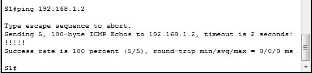

#  Настройка STP
###  Схема топологии настраевоемой сети:

##	Цели
* Часть 1. Создание сети и настройка основных параметров устройства
* Часть 2. Выбор корневого моста
* Часть 3. Наблюдение за процессом выбора протоколом STP порта, исходя из стоимости портов
* Часть 4. Наблюдение за процессом выбора протоколом STP порта, исходя из приоритета портов

# Часть 1
## Шаг 3
###  Конфигурация устройств согласно методичке:
- [Конфигурационные файлы;](config/)

## Шаг 4
Проверить связь между:
* от коммутатора S1 на коммутатор S2

* от коммутатора S1 на коммутатор S3

* от коммутатора S2 на коммутатор S3

