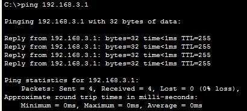
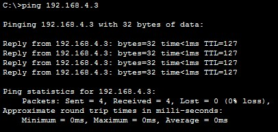
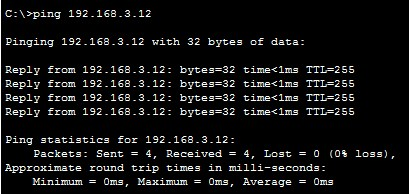
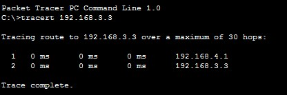

#  Настройка VLAN 

###  Задание согласно методичке:

  1. Построение сети и настройка основных параметров устройства.
  2. Создание сетей VLAN и назначение портов коммутатора
  3. Настройка TRUNK 802.1Q между коммутаторами
  4. Настройка маршрутизации между VLAN на маршрутизаторе
  5. Убедиться, что маршрутизация между VLAN работает

###  Схема топологии настраевоемой сети:

###  Таблица адресации:

###  Таблица VLAN:

###  Конфигурация устройств согласно методичке:
- [Конфигурационные файлы;](config/)

###  Итоговый результат после настройки:
* Ping from PC-A to its default gateway.

* Ping from PC-A to PC-B

* Ping from PC-A to S2

* Tracert_from_PC-A_to_PC-B

