#  iBGP.

###  Задание:

iBGP.

Цель: Настроить iBGP в офисе Москва
Настроить iBGP в сети провайдера Триада
Организовать полную IP связанность всех сетей

1. Настроите iBGP в провайдере Триада
2. iBGP в офисе Москва между маршрутизаторами R14 и R15
3. Настройте офиса Москва так, чтобы приоритетным провайдером стал Ламас.
4. Настройте офиса С.-Петербург так, чтобы трафик до любого офиса распределялся по двум линкам одновременно
5. Все сети в лабораторной работе должны иметь IP связность

## 1. Настроите iBGP в провайдере Триада

### Схема сети

- [Конфигурационные файлы](config/)

### Адресация Триада

 Триада (AS 520).

| Network IPv4     | Summary net    | Network IPv6             | Summary net         | Description   | Eq&port         |
|-----------------:|:---------------|-------------------------:|:--------------------|:-------------:|-----------------|
| 10.10.10.0/30    | 10.10.10.0/24  | 20AA:BBCC:10:0::/64      | 20AA:BBCC:10::/48   | Триада AS 520 | R23e0/1 R25e0/0 |
| 10.10.10.4/30    | 10.10.10.0/24  | 20AA:BBCC:10:4::/64      | 20AA:BBCC:10::/48   | Триада AS 520 | R25e0/2 R26e0/2 |
| 10.10.10.8/30    | 10.10.10.0/24  | 20AA:BBCC:10:8::/64      | 20AA:BBCC:10::/48   | Триада AS 520 | R26e0/0 R24e0/1 |
| 10.10.10.12/30   | 10.10.10.0/24  | 20AA:BBCC:10:12::/64     | 20AA:BBCC:10::/48   | Триада AS 520 | R23e0/2 R24e0/2 |

| Name    | IPv4LoopBack    |  City        |
|-----------------:|:---------------|-------------------------:|
|	R23	             |	23.23.23.23/32	|Триада |
|	R24	             |	24.24.24.24/32	|Триада |
|	R25	             |	25.25.25.25/32	|Триада |
|	R26	             |	26.26.26.26/32	|Триада |

### Конфигурация маршрутизаторов для iBGP соседства аналогична настройкам eBGP и сводиться к следующим настройкам:

1. Включаем на всех роутерах процес BGP с номером AS согласно схемы. 
          
       RX(config)#router BGP X - где X номер автономной системы.
       Для iBGP номер AS один и тот же в пределах этой AS
       
 Роутеры учавствующие в обмене BGP Update:
 
    R23 - Триада
    R24 - Триада
    R25 - Триада 
    R26 - Триада 
   
 
2. Назначаем на каждом роутере Router ID для BGP. 

       RX(config)#router bgp X
       RX(config-router)#bgp router-id x.x.x.x - где x.x.x.x номер роутера согласно схемы. R23 - router-id 23.23.23.23
     
     
3. Устанавливаем сосдество по iBGP согласно задания.
Для установления соседства по iBGP нужно устанавливать соседство каждый с каждым (Full Mesh) Предподчтителнее использовать LoopBack интерфейсы

       
 Пример для роутреа R23
 
       R23 - Триада (23.23.23.23)  - R24 - Триада (24.24.24.24)
       R23 - Триада (23.23.23.23)  - R25 - Триада (25.25.25.25)
       R23 - Триада (23.23.23.23)  - R26 - Триада (26.26.26.26)
       
       
  Для установления BGP соседства необходимо на каждом роутере указать команду:
  
       RX(config)#router bgp X
       RX(config-router)#neighbor x.x.x.x remote-as Z - где x.x.x.x IP соседа с кем устанавливается BGP, а Z - номер автономной системы BGP соседа
       RX(config-router)#neighbor x.x.x.x update-source loopback0 - команда update-source указывает из под какого интрефейса устанавливать соседство. В данном случае интерфейс loopback0
       
### Пример R23 Триада - R24 Триада
  
       R23(config)#router bgp 520
       R23(config-router)#neighbor 24.24.24.24 remote-as 520
       R23(config-router)#neighbor 24.24.24.24 update-source Loopback0
       
### Пример R24 Триада - R23 Триада
  
       R24(config)#router bgp 520
       R24(config-router)#neighbor 23.23.23.23 remote-as 520
       R24(config-router)#neighbor 23.23.23.23 update-source Loopback0       
       
  После выполнения данных команд на каждом роутере создается BGP соседвство.
  
### Пример роутера R23 и R26 Триада AS 520 после установления соседства по iBGP

## 2. iBGP в офисе Москва между маршрутизаторами R14 и R15

iBGP между роутерами R14 и R15 аналогична настройкам iBGP Триада

1. Включаем на всех роутерах процес BGP с номером AS согласно схемы. 
          
       RX(config)#router BGP X - где X номер автономной системы.
       Для iBGP номер AS один и тот же в пределах этой AS

Роутеры учавствующие в обмене BGP Update:
 
    R14 - Москва
    R15 - Москва
    
2. Назначаем на каждом роутере Router ID для BGP. (ID был назначен в первом задании по BGP, но повторюсь)  

       RX(config)#router bgp X
       RX(config-router)#bgp router-id x.x.x.x - где x.x.x.x номер роутера согласно схемы. R14 - router-id 14.14.14.14

3. Устанавливаем сосдество по iBGP согласно задания.

       R14 - Москва (14.14.14.14)  - R15 - Москва (15.15.15.15)
       R15 - Москва (15.15.15.15)  - R14 - Москва (14.14.14.14) 
 
Пример роутера R14 и R15 Москва AS 1001 после установления соседства по iBGP

## 3. Настройте офис Москвы так, чтобы приоритетным провайдером стал Ламас.

### Схема сети Москва

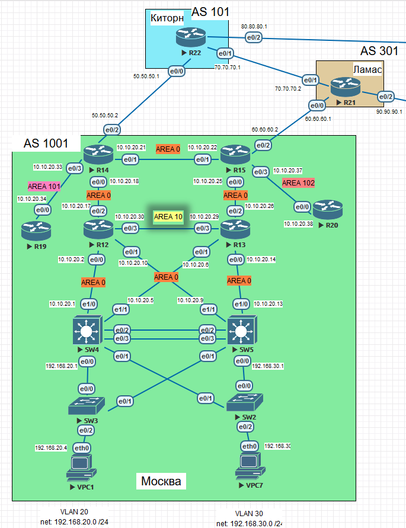

Как видно из скриншота, на роутере R14 префиксы (192.168.40.0/24 и 192.168.50.0/24) получаемые по BGP уходят через Киторн (50.50.50.1)

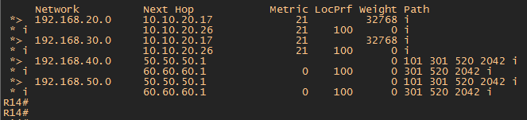

Trace VPC1 так же показывает, что маршрут идет через Киторн (50.50.50.1)

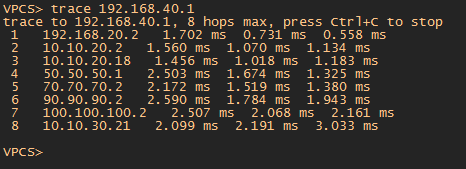

Для решения данной задачи можно использовать несколько вариантов:

1. Использовать атрибут Weight, но Weight это Cisco атрибут, соответсвенно он может применяться только между роутерами Cisco. В нашем варианте это подходит, но так же он не передается между роутерами, то есть локальный и этот атрибут придется настраивать на каждом роутере. В нашем случае это 2 роутера.... а если их будет 15-20?!, то настраивать придется на всех.

2. Иcпользовать атрибут Local Preference. Данные атрибут входит в группу Well-known discretionary. То есть распознается всеми маршрутизаторами. Так же его плюс в том, что он передается в Update в собсвенной AS между всеми роутерами-соседями iBGP. Т.е. задал атрибут на одном роутере и данный атрибут распространился на всех.
Для его настройки необходимо на роутере R15 выполнить следующие команды:

      R15(config)# route-map LAMAS permit 10 - создаем route-map
      
      R15(config-route-map)# set local-preference 150 - устанавливаем local-preference в значение 150 для всех маршрутов, которые мы получим от соседа
      
      R15(config-router)#neighbor 60.60.60.1 route-map LAMAS in - применяем route-map к соседу
      
     
 Как видно из скриншота на роутере R14 изменился LocPrf для префиксов 192.168.40.0 и 192.168.50.0, но в таблице BGP по прежнему в приоритете остается маршрут через Киторн (50.50.50.1). 
 
 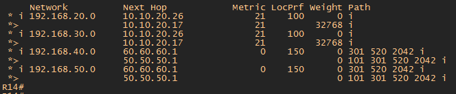
 
 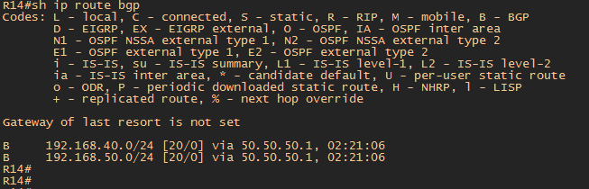
 
 
Это связанно с тем, что Update пришедший от роутера R21 Ламас на роутер R15 Москва содержит Next-Hop 60.60.60.1 и далее R15 передает этот Update по iBGP на роутер R14 не меняя Next-Hop. 
 
Соответственно у роутреа R14 нет маршрута до сети 60.60.60.0.

Для решения этой проблемы необходимо на роутере R15 задать команду:

     R15(config-router)#neighbor 14.14.14.14 next-hop-self - указать роутеру R14 использовать следующий переход роутера R15
     
Теперь таблица BGP и таблица маршрутизации роутреа R14 выглядит следующим образом:

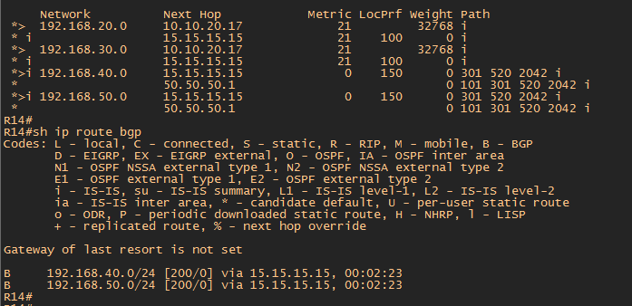
    
 Trace VPC1 теперь идет через Ламас (60.60.60.1)
 
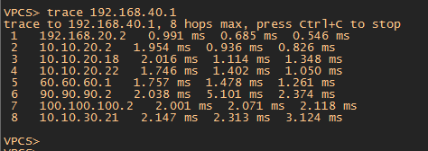

## 4. Настройте офис С.-Петербург так, чтобы трафик до любого офиса распределялся по двум линкам одновременно

На данный момент роутер R18 имеет таблицу маршрутизации BGP и таблицу BGP в таком виде:

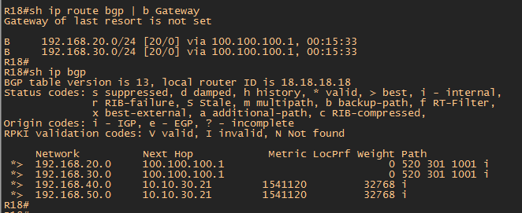

Введем на роутере R18 команду:

    R18(config-router)#maximum-paths 2
    
    
    
Результат команды не изменил таблицу маршрутизации BGP и таблицу BGP.    

Маршруты до сетей Москвы идут только через роутер R24. Т.е в таблице BGP R18 нет записи о префиксах Москвы через роутер R26.

Обратимся к таблице BGP R26.

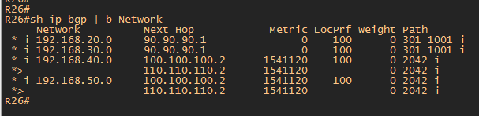

Видно, что префиксы получаемые от Москвы имеют Next Hop 90.90.90.1. Но R26 не знает как добраться до сети 90.90.90.0 /24. Так как Update от R24 идущий к R26 не меняет Next Hop. Исправим это и на R24 введем следующую команду

     R24(config-router)#neighbor 26.26.26.26 next-hop-self 
     
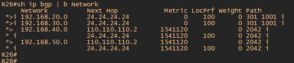

Теперь R26 имеет Next Hop 24.24.24.24 до сетей Москвы и дальше передает данный Update на R18

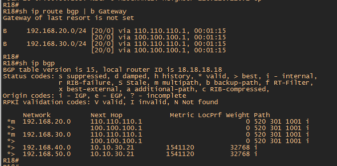

Из скриншота выидно что сети Москвы доступны по двум путям

## 5. Все сети в лабораторной работе должны иметь IP связность

Для решения данной задачи необходимо в офисах Москва и С.Питер анонсировать сети МGMT активного оборудования. Т.к. конечные пользовательские сети офисов были анонсированы в предыдущих задания.

1. Для анонса сети нужно "отдать" сумированный маршрут для сокращения таблицы маршрутизаторов принимающих анонсированные маршруты.

В Москве для соединения активного оборудования используются сети 

Москва (AS 1001).

| Network IPv4     | Summary net    | Network IPv6             | Summary net         | Description   | Eq&port         |
|-----------------:|:---------------|-------------------------:|:--------------------|:-------------:|-----------------|
| 10.10.20.0/30    | 10.10.20.0/24  | 20AA:BBCC:20:0::/64      | 20AA:BBCC:20::/48   | Москва AS 1001| SW4e1/0 R12e0/0 |
| 10.10.20.4/30    | 10.10.20.0/24  | 20AA:BBCC:20:4::/64      | 20AA:BBCC:20::/48   | Москва AS 1001| SW4e1/1 R13e0/1 |
| 10.10.20.8/30    | 10.10.20.0/24  | 20AA:BBCC:20:8::/64      | 20AA:BBCC:20::/48   | Москва AS 1001| SW5e1/1 R12e0/1 |
| 10.10.20.12/30   | 10.10.20.0/24  | 20AA:BBCC:20:12::/64     | 20AA:BBCC:20::/48   | Москва AS 1001| SW5e1/0 R13e0/0 |
| 10.10.20.16/30   | 10.10.20.0/24  | 20AA:BBCC:20:16::/64     | 20AA:BBCC:20::/48   | Москва AS 1001| R12e0/2 R14e0/0 |
| 10.10.20.20/30   | 10.10.20.0/24  | 20AA:BBCC:20:20::/64     | 20AA:BBCC:20::/48   | Москва AS 1001| R12e0/3 R15e0/1 |
| 10.10.20.24/30   | 10.10.20.0/24  | 20AA:BBCC:20:24::/64     | 20AA:BBCC:20::/48   | Москва AS 1001| R13e0/3 R14e0/1 |
| 10.10.20.28/30   | 10.10.20.0/24  | 20AA:BBCC:20:28::/64     | 20AA:BBCC:20::/48   | Москва AS 1001| R13e0/2 R15e0/0 |
| 10.10.20.32/30   | 10.10.20.0/24  | 20AA:BBCC:20:32::/64     | 20AA:BBCC:20::/48   | Москва AS 1001| R14e0/3 R19e0/0 |
| 10.10.20.36/30   | 10.10.20.0/24  | 20AA:BBCC:20:36::/64     | 20AA:BBCC:20::/48   | Москва AS 1001| R15e0/3 R20e0/0 |

В Питере для соединения активного оборудования используются сети 

Санкт-Питербург (AS 2042).

| Network IPv4     | Summary net    | Network IPv6             | Summary net         | Description   | Eq&port          |
|-----------------:|:---------------|-------------------------:|:--------------------|:-------------:|------------------|
| 10.10.30.0/30    | 10.10.30.0/24  | 20AA:BBCC:30:0::/64      | 20AA:BBCC:20::/48   | Питер AS 2042 | SW9e0/3  R17e0/0 |
| 10.10.30.4/30    | 10.10.30.0/24  | 20AA:BBCC:30:4::/64      | 20AA:BBCC:20::/48   | Питер AS 2042 | SW9e1/0  R16e0/2 |
| 10.10.30.8/30    | 10.10.30.0/24  | 20AA:BBCC:30:8::/64      | 20AA:BBCC:20::/48   | Питер AS 2042 | SW9e0/0 SW10e0/0 |
| 10.10.30.12/30   | 10.10.30.0/24  | 20AA:BBCC:30:12::/64     | 20AA:BBCC:20::/48   | Питер AS 2042 | SW10e1/0 R17e0/2 |
| 10.10.30.16/30   | 10.10.30.0/24  | 20AA:BBCC:30:16::/64     | 20AA:BBCC:20::/48   | Питер AS 2042 | SW10e0/3 R16e0/0 |
| 10.10.30.20/30   | 10.10.30.0/24  | 20AA:BBCC:30:20::/64     | 20AA:BBCC:20::/48   | Питер AS 2042 | R17e0/1  R18e0/1 |
| 10.10.30.24/30   | 10.10.30.0/24  | 20AA:BBCC:30:24::/64     | 20AA:BBCC:20::/48   | Питер AS 2042 | R16e0/1  R18e0/0 |
| 10.10.30.28/30   | 10.10.30.0/24  | 20AA:BBCC:30:28::/64     | 20AA:BBCC:20::/48   | Питер AS 2042 | R16e0/3  R32e0/0 |

На роутерах R14 и R15 нужно выполнить команду:

     R14-15(config-router)#network 10.10.20.0 mask 255.255.255.0
     
Но BGP проверяет точное совпадение в таблице маршрутизации для того, что бы анонсировать сеть соседям. Такой сети в таблице нет. еее необходимо добавить командой:

     R14-15(config)ip route 10.10.20.0 255.255.255.0 Null0 
     
Аналогично такие же команды выполнить на роутере R18 Питер  

     R18(config-router)#network 10.10.30.0 mask 255.255.255.0
     R18(config)ip route 10.10.30.0 255.255.255.0 Null0 
     
После выполнения данных команд на роутерах Москва и Питер в таблице маршрутизации появились следующие сети:  

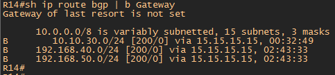

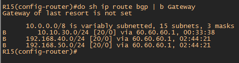

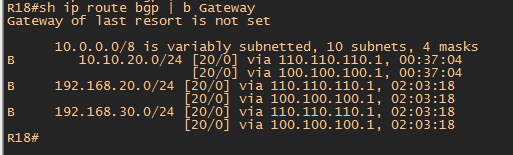

Пинги от R14 Москва до роутеров Питера

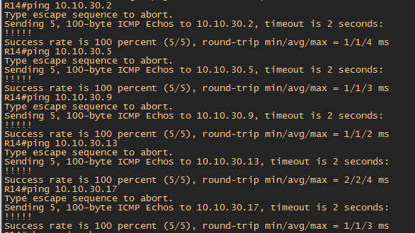
