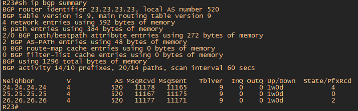

#  iBGP.

###  Задание:

iBGP.

Цель: Настроить iBGP в офисе Москва
Настроить iBGP в сети провайдера Триада
Организовать полную IP связанность всех сетей

1. Настроите iBGP в провайдере Триада
2. iBGP в офисе Москва между маршрутизаторами R14 и R15
3. Настройте офиса Москва так, чтобы приоритетным провайдером стал Ламас.
4. Настройте офиса С.-Петербург так, чтобы трафик до любого офиса распределялся по двум линкам одновременно
5. Все сети в лабораторной работе должны иметь IP связность
6. План работы и изменения зафиксированы в документации

## 1. Настроите iBGP в провайдере Триада

### Схема сети

- [Конфигурационные файлы](config/)

### Адресация Триада

 Триада (AS 520).

| Network IPv4     | Summary net    | Network IPv6             | Summary net         | Description   | Eq&port         |
|-----------------:|:---------------|-------------------------:|:--------------------|:-------------:|-----------------|
| 10.10.10.0/30    | 10.10.10.0/24  | 20AA:BBCC:10:0::/64      | 20AA:BBCC:10::/48   | Триада AS 520 | R23e0/1 R25e0/0 |
| 10.10.10.4/30    | 10.10.10.0/24  | 20AA:BBCC:10:4::/64      | 20AA:BBCC:10::/48   | Триада AS 520 | R25e0/2 R26e0/2 |
| 10.10.10.8/30    | 10.10.10.0/24  | 20AA:BBCC:10:8::/64      | 20AA:BBCC:10::/48   | Триада AS 520 | R26e0/0 R24e0/1 |
| 10.10.10.12/30   | 10.10.10.0/24  | 20AA:BBCC:10:12::/64     | 20AA:BBCC:10::/48   | Триада AS 520 | R23e0/2 R24e0/2 |

| Name    | IPv4LoopBack    |  City        |
|-----------------:|:---------------|-------------------------:|
|	R23	             |	23.23.23.23/32	|Триада |
|	R24	             |	24.24.24.24/32	|Триада |
|	R25	             |	25.25.25.25/32	|Триада |
|	R26	             |	26.26.26.26/32	|Триада |

### Конфигурация маршрутизаторов для iBGP соседства аналогична настройкам eBGP и сводиться к следующим настройкам:

1. Включаем на всех роутерах процес BGP с номером AS согласно схемы. 
          
       RX(config)#router BGP X - где X номер автономной системы.
       Для iBGP номер AS один и тот же в пределах этой AS
       
 Роутеры учавствующие в обмене BGP Update:
 
    R23 - Триада
    R24 - Триада
    R25 - Триада 
    R26 - Триада 
   
 
2. Назначаем на каждом роутере Router ID для BGP. 

       RX(config)#router bgp X
       RX(config-router)#bgp router-id x.x.x.x - где x.x.x.x номер роутера согласно схемы. R23 - router-id 23.23.23.23
     
     
3. Устанавливаем сосдество по iBGP согласно задания.
Для установления соседства по iBGP нужно устанавливать соседство каждый с каждым (Full Mesh) Предподчтителнее использовать LoopBack интерфейсы

       
 Пример для роутреа R23
 
       R23 - Триада (23.23.23.23)  - R24 - Триада (24.24.24.24)
       R23 - Триада (23.23.23.23)  - R25 - Триада (25.25.25.25)
       R23 - Триада (23.23.23.23)  - R26 - Триада (26.26.26.26)
       
       
  Для установления BGP соседства необходимо на каждом роутере указать команду:
  
       RX(config)#router bgp X
       RX(config-router)#neighbor x.x.x.x remote-as Z - где x.x.x.x IP соседа с кем устанавливается BGP, а Z - номер автономной системы BGP соседа
       RX(config-router)#neighbor x.x.x.x update-source loopback0 - команда update-source указывает из под какого интрефейса устанавливать соседство. В данном случае интерфейс loopback0
       
### Пример R23 Триада - R24 Триада
  
       R23(config)#router bgp 520
       R23(config-router)#neighbor 24.24.24.24 remote-as 520
       R23(config-router)#neighbor 24.24.24.24 update-source Loopback0
       
### Пример R24 Триада - R23 Триада
  
       R24(config)#router bgp 520
       R24(config-router)#neighbor 23.23.23.23 remote-as 520
       R24(config-router)#neighbor 23.23.23.23 update-source Loopback0       
       
  После выполнения данных команд на каждом роутере создается BGP соседвство.
  
### Пример роутера R23 и R26 Триада AS 520 после установления соседства по iBGP

## 2. iBGP в офисе Москва между маршрутизаторами R14 и R15

iBGP между роутерами R14 и R15 аналогична настройкам iBGP Триада

1. Включаем на всех роутерах процес BGP с номером AS согласно схемы. 
          
       RX(config)#router BGP X - где X номер автономной системы.
       Для iBGP номер AS один и тот же в пределах этой AS

Роутеры учавствующие в обмене BGP Update:
 
    R14 - Москва
    R15 - Москва
    
2. Назначаем на каждом роутере Router ID для BGP. (ID был назначен в первом задании по BGP, но повторюсь)  

       RX(config)#router bgp X
       RX(config-router)#bgp router-id x.x.x.x - где x.x.x.x номер роутера согласно схемы. R14 - router-id 14.14.14.14

3. Устанавливаем сосдество по iBGP согласно задания.

       R14 - Москва (14.14.14.14)  - R15 - Москва (15.15.15.15)
       R15 - Москва (15.15.15.15)  - R14 - Москва (14.14.14.14) 
 
Пример роутера R14 и R15 Москва AS 1001 после установления соседства по iBGP

